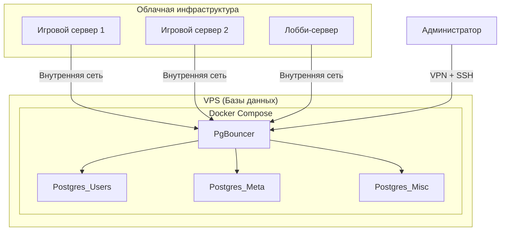
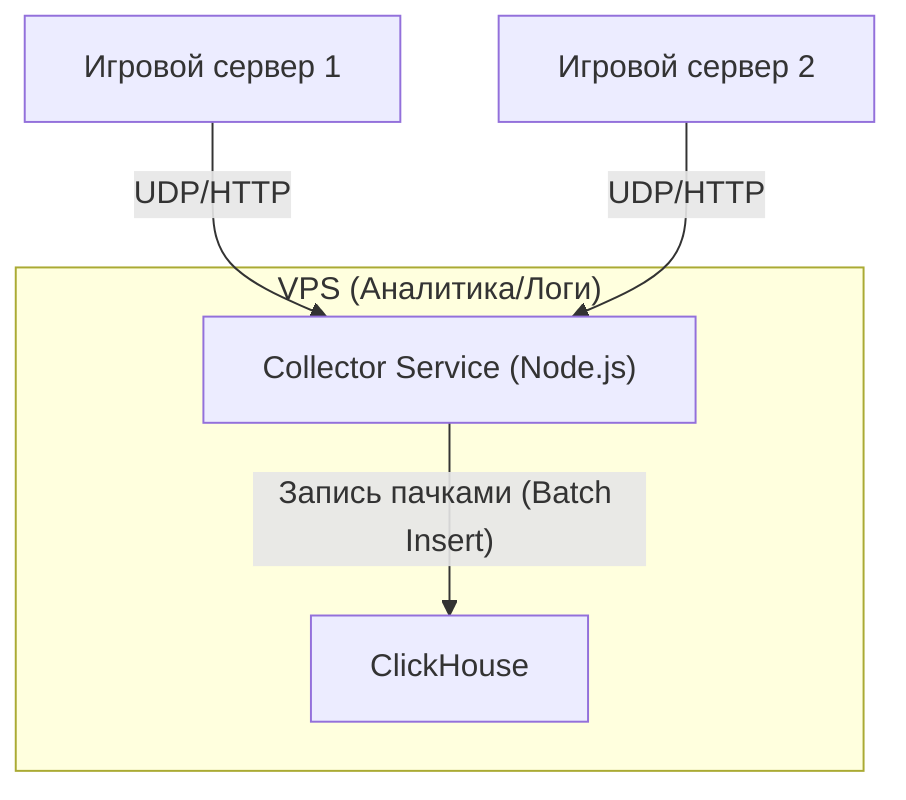

# 30. Архитектура персистентности и реплеев

## 1. Основная база данных: PostgreSQL

Как вы и предложили, для хранения основных данных игроков будет использоваться кластер PostgreSQL, управляемый через Docker Compose.

### 1.1. Инфраструктура

-   **Хостинг:** Отдельный VPS для баз данных.
-   **Доступ:**
    -   **Внешний:** Через VPN + SSH-туннель для безопасного доступа разработчиков и администраторов.
    -   **Внутренний:** Микросервисы (игровые серверы, лобби-сервер) будут подключаться через внутреннюю (приватную) сеть облачного провайдера.
-   **Оркестрация:** Docker Compose для управления контейнерами.
-   **Connection Pooling:** **PgBouncer** будет стоять перед инстансами Postgres. Это **критически важный** компонент, который будет управлять пулом соединений от сотен потенциальных игровых серверов, предотвращая перегрузку БД.

### 1.2. Диаграмма архитектуры PostgreSQL



### 1.3. Логическое разделение инстансов

Для распределения нагрузки данные будут разделены по разным инстансам:

1.  **`Postgres_Users` (Данные аккаунтов):**
    -   **Содержимое:** Таблицы пользователей (ID, хеш пароля, email), профили, социальный граф (друзья, кланы), баны.
    -   **Тип нагрузки:** В основном чтение (при логине, загрузке профиля). Запись редкая.

2.  **`Postgres_Meta` (Мета-прогрессия игрока):**
    -   **Содержимое:** Инвентарь, количество soft/hard валюты, состояние построенных зданий, открытое оружие и навыки, статистика игрока.
    -   **Тип нагрузки:** **Очень высокая.** Интенсивная запись после каждого матча и при каждом улучшении. Интенсивное чтение при каждом входе в игру. **Это самая нагруженная база.**

3.  **`Postgres_Misc` (Прочие данные):**
    -   **Содержимое:** Таблицы лидеров, история матчей (только метаданные: кто играл, результат, дата), данные гильдий.
    -   **Тип нагрузки:** Смешанная. Интенсивная запись в leaderboard, но чтение реже.

## 2. База данных для реплеев и логов

### 2.1. Требования
-   **Задача:** Хранить огромные объемы **time-series** данных (события, происходящие во времени).
-   **Тип данных:** Все инпуты игроков, все состояния мира, все команды AI-директора.
-   **Нагрузка:** **Экстремально высокая на запись (write-heavy).** Чтение редкое, в основном последовательное (при просмотре реплея).
-   **Хранение:** Данные за последний месяц, старые должны удаляться автоматически.

### 2.2. Рекомендация: ClickHouse

Использовать для этой задачи PostgreSQL — неэффективно. Идеальным решением будет **ClickHouse**, который вы уже планируете для аналитики.

**Почему ClickHouse — лучший выбор:**
-   **Колончатая СУБД:** Он создан для хранения и обработки логов и событий.
-   **Высочайшая скорость записи:** Способен принимать миллионы записей в секунду.
-   **Эффективное сжатие:** Данные будут занимать в 3-5 раз меньше места, чем в Postgres, что критично для логов.
-   **TTL (Time-To-Live):** В ClickHouse есть встроенная поддержка автоматического удаления старых данных, что идеально подходит под ваше требование "хранить за последний месяц".
-   **Упрощение стека:** Мы не вводим новую технологию, а переиспользуем ту, что уже есть в плане.

### 2.3. Архитектура сбора логов для реплеев

Прямая запись из каждого игрового сервера в БД создаст слишком большую нагрузку. Правильный подход — использовать промежуточный сервис-коллектор.


-   **Игровой сервер:** Не пишет в базу напрямую. Он "выплевывает" события (инпуты, состояния мира) по легковесному протоколу (например, UDP) в сторону коллектора.
-   **`Collector Service`:** Простое Node.js приложение, которое слушает порт, собирает события в большие пачки (например, 1000 событий или раз в секунду) и выполняет одну большую вставку в ClickHouse. Это **на порядки** эффективнее, чем множество мелких записей.

### 2.4. Структура таблицы в ClickHouse

```sql
CREATE TABLE match_logs (
    match_id String,
    timestamp DateTime,
    event_type Enum('INPUT', 'STATE', 'AI_COMMAND'),
    payload String -- JSON-строка с данными
) ENGINE = MergeTree()
PARTITION BY toYYYYMM(timestamp)
ORDER BY (match_id, timestamp)
TTL timestamp + INTERVAL 1 MONTH;
```
Эта структура позволит очень быстро выбирать все события для конкретного матча (`WHERE match_id = '...'`) и воспроизводить их по `timestamp`.
