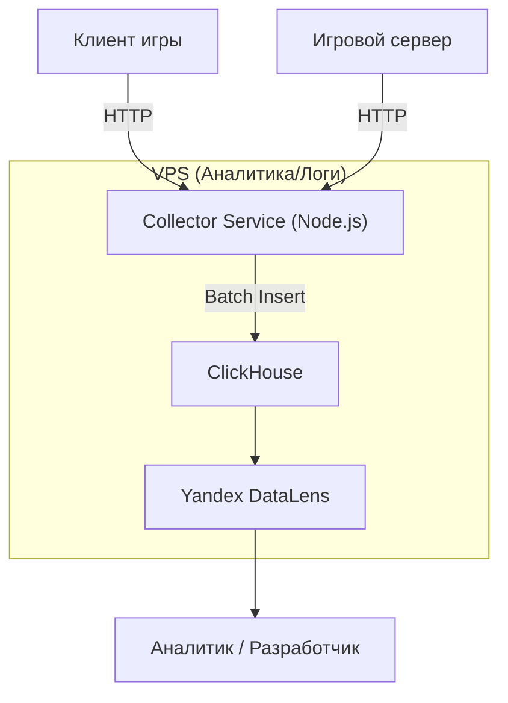

# 31. Архитектура аналитики и список событий

## 1. Инфраструктура

Как и было определено, для аналитики используется связка **ClickHouse + Yandex DataLens**.

-   **Сбор данных:** Осуществляется через тот же **`Collector Service`**, что и для логов реплеев. Это позволяет нам иметь единую точку входа для всех игровых событий.
-   **Хранение:** ClickHouse на отдельном VPS.
-   **Визуализация:** Yandex DataLens подключается к ClickHouse как к источнику данных.

### 1.1. Диаграмма потока данных

## 2. Философия сбора событий

-   **Клиент — источник UX-событий:** Клиент отслеживает все, что связано с взаимодействием пользователя с интерфейсом (нажатия кнопок, переходы по экранам) и производительностью устройства.
-   **Сервер — источник правды:** Сервер отслеживает все **ключевые игровые и экономические события**. Нельзя доверять клиенту в том, что касается денег или результатов матча.

## 3. Детальный список событий

### 3.1. Клиентские события (UX и производительность)

| Event Name | Trigger | Parameters |
|---|---|---|
| `app_start` | Первый запуск приложения после установки | `device_id`, `platform` (iOS/Android), `app_version` |
| `session_start` | Запуск приложения | `user_id` (если залогинен), `device_id`, `session_id` |
| `screen_view` | Открытие любого экрана/вкладки | `screen_name` (e.g., "main_menu", "shop"), `session_id` |
| `ui_click` | Нажатие на важную кнопку | `button_id` (e.g., "start_heist_button"), `screen_name` |
| `performance_summary` | В конце каждого матча | `avg_fps`, `min_fps`, `device_model`, `ram_usage` |

### 3.2. Серверные события (Игровой цикл)

| Event Name | Trigger | Parameters |
|---|---|---|
| `match_start` | Начало любого матча (PvE или PvP) | `match_id`, `user_id`, `match_type` (pve/pvp), `team_size` |
| `match_end` | Завершение матча | `match_id`, `user_id`, `duration_seconds`, `is_victory`, `loot_collected`, `kills`, `deaths` |
| `player_death` | Смерть игрока | `match_id`, `user_id`, `killer_id` (если другой игрок), `death_reason` (e.g., "enemy_melee"), `position` |
| `enemy_killed` | Убийство врага игроком | `match_id`, `user_id`, `enemy_type`, `weapon_used` |
| `objective_complete` | Выполнение цели миссии | `match_id`, `user_id`, `objective_id` |

### 3.3. Серверные события (Экономика и монетизация)

| Event Name | Trigger | Parameters |
|---|---|---|
| `currency_earned` | Получение любой валюты | `user_id`, `currency_type` (soft/hard), `amount`, `source` (e.g., "match_reward", "daily_quest") |
| `currency_spent` | Трата любой валюты | `user_id`, `currency_type`, `amount`, `sink` (e.g., "building_upgrade", "lootbox_purchase") |
| `building_upgrade_start` | Начало постройки/улучшения здания | `user_id`, `building_id`, `target_level`, `soft_cost` |
| `building_upgrade_finish` | Завершение улучшения (включая ускорение) | `user_id`, `building_id`, `target_level`, `time_spent_seconds`, `hard_spent_for_speedup` |
| `lootbox_opened` | Открытие лутбокса | `user_id`, `source` (purchase/quest), `dropped_item_id`, `dropped_item_type` |
| `iap_purchase_attempt` | Открытие окна покупки за реальные деньги | `user_id`, `product_id` (e.g., "gems_pack_1"), `placement` (где нажал) |
| `iap_purchase_success` | Успешная покупка | `user_id`, `product_id`, `revenue_usd` |

## 4. Как отправлять события

-   **Клиент и Сервер:** Формируют JSON-объект с именем события и его параметрами.
-   **Отправка:** Отправляют этот JSON по HTTP POST на единый эндпоинт **`Collector Service`**.
-   **Collector Service:** Валидирует событие, обогащает его серверными данными (IP, timestamp) и складывает в очередь для пакетной вставки в ClickHouse.
