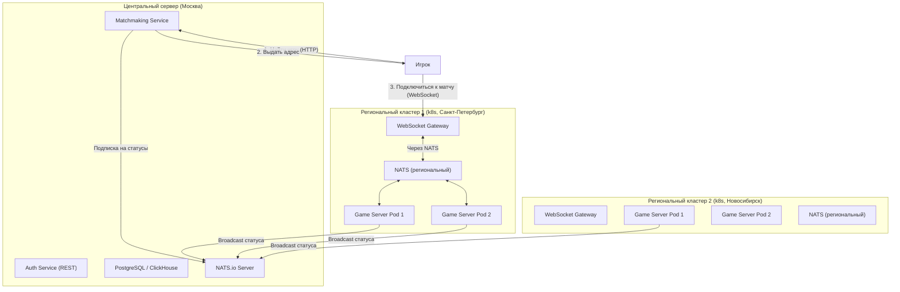

# 33. Архитектура масштабирования и оркестрации серверов

## 1. Высокоуровневая концепция: Центральный "мозг" и региональные "руки"

Архитектура разделена на два типа локаций для достижения низкого пинга и централизованного управления.

1.  **Центральный сервер (Москва):** Здесь находятся сервисы, не требующие низкой задержки, и основные базы данных. Это "мозг" всей системы.
2.  **Региональные кластеры (VPS в разных городах):** Здесь работают только те сервисы, которые напрямую обслуживают игровой процесс в реальном времени. Это "руки", которые находятся близко к игрокам.

### 1.1. Диаграмма архитектуры



## 2. Компоненты и их роли

-   **Matchmaking Service:** Главный дирижер. Знает обо всех доступных игровых серверах, их нагрузке и местоположении. Принимает запросы от игроков и назначает им лучший сервер.
-   **NATS.io Server:** Высокопроизводительный брокер сообщений. Используется для "служебной" связи между сервисами.
-   **Game Server Pod (Боевой сервис):** Pod в Kubernetes, где запущен один инстанс игрового сервера. Обрабатывает логику одного или нескольких матчей.
-   **WebSocket Gateway:** Pod в Kubernetes, который является единственной точкой входа для всех WebSocket-соединений игроков в данном регионе. Он не содержит игровой логики, а только проксирует сообщения.
-   **NATS (региональный):** Внутренняя шина сообщений в рамках k8s кластера. Позволяет WebSocket Gateway и Game Server'ам общаться, не зная IP-адресов друг друга, что обеспечивает гибкое масштабирование. Используется тот же NATS, что и для связи с центром — единый транспорт для всей системы.

---

## 3. Детальные схемы взаимодействия

### 3.1. Матчмейкинг <-> Боевые сервера (через NATS)

Это постоянный фоновый процесс.

-   **Кто:** Game Server Pod -> NATS -> Matchmaking Service.
-   **Как:** Каждый Game Server раз в 5 секунд публикует (broadcast) сообщение в общую тему (subject) `server.status`.
-   **Протокол сообщения (JSON):**
    ```json
    {
      "server_id": "k8s-pod-name-spb-1a",
      "region": "RU-SPE", // Код региона
      "city": "Saint Petersburg",
      "public_ip": "1.2.3.4", // IP WebSocket Gateway этого кластера
      "current_players": 50,
      "running_matches": 10,
      "max_matches": 20
    }
    ```
-   **Результат:** `Matchmaking Service` подписан на тему `server.status` и в реальном времени поддерживает актуальную таблицу всех доступных серверов и их загруженности.

### 3.2. Клиент -> Матчмейкинг (Поиск игры)

Это короткий HTTP-запрос от клиента, когда он нажимает "Найти игру".

-   **Кто:** Клиент -> Matchmaking Service.
-   **Как:** `POST /matchmaking/find`
-   **Запрос (JSON):**
    ```json
    {
      "user_id": "uuid-1234",
      "game_mode": "pve_heist",
      "jwt_token": "..." // Для аутентификации
    }
    ```
-   **Логика `Matchmaking Service`:**
    1.  Получает IP-адрес клиента из запроса.
    2.  С помощью GeoIP-базы определяет его примерное местоположение.
    3.  Просматривает свою таблицу серверов (полученную через NATS).
    4.  Выбирает **лучший сервер**, вычисляя "стоимость" подключения = `ping_to_server` (на основе расстояния) + `server_load_penalty`.
    5.  Отправляет выбранному Game Server'у команду "подготовить матч" (например, через NATS, но уже в приватную тему `server.command.{server_id}`).
    6.  Получает в ответ `match_id`.
-   **Ответ (JSON, 200 OK):**
    ```json
    {
      "match_id": "uuid-match-5678",
      "websocket_url": "ws://1.2.3.4:8080", // Адрес WebSocket Gateway в Питере
      "token": "one-time-match-token" // Одноразовый токен для подключения к матчу
    }
    ```

### 3.3. Клиент -> WebSocket Gateway -> Game Server (Подключение к матчу)

Это основной, долговременный процесс игры.

1.  **Подключение:** Клиент, получив ответ от матчмейкера, устанавливает WebSocket-соединение по указанному `websocket_url`.
2.  **Аутентификация:** Первое сообщение, которое клиент отправляет по WebSocket — это аутентификация.
    -   **Запрос (JSON):**
        ```json
        {
          "type": "AUTH",
          "match_id": "uuid-match-5678",
          "token": "one-time-match-token"
        }
        ```
3.  **Маршрутизация (внутри k8s):**
    -   **WebSocket Gateway** получает это сообщение.
    -   Он смотрит на `match_id` и через внутреннюю логику (например, обращение к Redis) узнает, какой именно `Game Server Pod` (`k8s-pod-name-spb-1a`) отвечает за этот матч.
    -   С этого момента Gateway знает, что все сообщения от этого клиента нужно отправлять в очередь, которую слушает `Game Server Pod 1a`, а все сообщения из очереди от `Game Server Pod 1a` для этого игрока нужно отправлять этому клиенту.
4.  **Игра:** Начинается обмен сообщениями `PLAYER_INPUT` и `WORLD_STATE` по протоколу, который мы уже определили. Для клиента и Game Server'а это выглядит так, как будто они общаются напрямую, хотя на самом деле между ними стоит Gateway и очередь.

**Преимущества такой схемы:**
-   **Низкий пинг:** Игрок всегда подключается к ближайшему к нему региональному серверу.
-   **Масштабируемость:** Мы можем добавлять новые региональные VPS и новые поды в Kubernetes по мере роста нагрузки. Матчмейкер автоматически начнет их использовать.
-   **Отказоустойчивость:** Если один Game Server Pod падает, Kubernetes автоматически поднимает новый. WebSocket Gateway перенаправит игроков на рабочие поды.
-   **Безопасность:** Игровая логика (Game Server) спрятана внутри приватной сети кластера. Наружу смотрит только stateless WebSocket Gateway.
