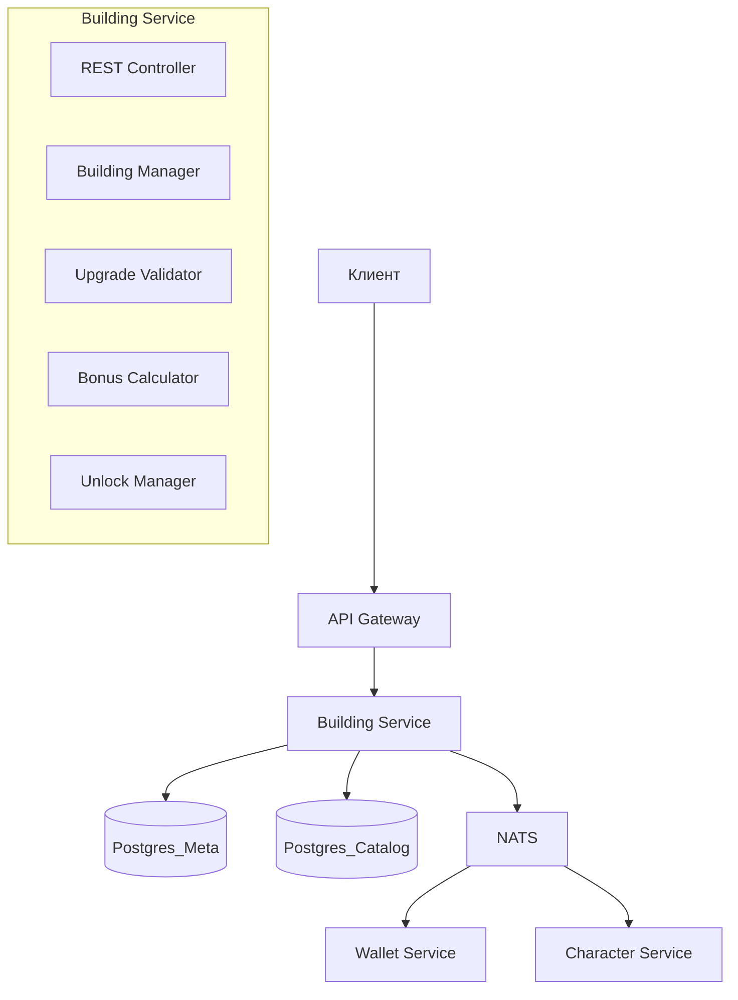

# 13. Building Service — Микросервис зданий

## 1. Обзор

**Building Service** — микросервис, отвечающий за всю логику социальной прогрессии: строительство, апгрейды зданий и разблокировку связанного контента (режимы, районы, механики).

### Зона ответственности
- CRUD операции со зданиями персонажа
- Валидация и выполнение апгрейдов
- Расчёт бонусов от зданий
- Разблокировка контента (режимы, районы)
- Пассивный доход (сбор с зданий)

### Не входит в ответственность
- Боевая прогрессия (трофеи, пул оружия) → **Combat Progress Service**
- Валюта и транзакции → **Wallet Service**
- Персонажи → **Character Service**

---

## 2. Архитектура



---

## 3. REST API

### 3.1. Получить здания персонажа

```http
GET /api/v1/characters/{characterId}/buildings
Authorization: Bearer <jwt>
```

**Response 200:**
```json
{
  "buildings": [
    {
      "buildingId": "headquarters",
      "level": 3,
      "slot": 1,
      "upgradedAt": "2026-02-10T15:30:00Z",
      "effects": {
        "characterSlots": 3,
        "buildingLimit": 8
      },
      "nextUpgrade": {
        "level": 4,
        "costSoft": 40000,
        "buildTimeMin": 360,
        "requirements": []
      }
    },
    {
      "buildingId": "armory",
      "level": 2,
      "slot": 2,
      "effects": {
        "weaponTiers": ["common", "uncommon"]
      },
      "nextUpgrade": {
        "level": 3,
        "costSoft": 12000,
        "buildTimeMin": 60,
        "requirements": [
          {"type": "building", "id": "headquarters", "level": 2}
        ]
      }
    }
  ],
  "totalSlots": 8,
  "usedSlots": 2
}
```

### 3.2. Построить здание

```http
POST /api/v1/characters/{characterId}/buildings
Authorization: Bearer <jwt>
Content-Type: application/json

{
  "buildingId": "laboratory",
  "slot": 3
}
```

**Response 201:**
```json
{
  "success": true,
  "building": {
    "buildingId": "laboratory",
    "level": 1,
    "slot": 3,
    "effects": { ... }
  },
  "transaction": {
    "softSpent": 3000
  },
  "userData": { ... }  // Полный UserData
}
```

**Ошибки:**
- `400 SLOT_OCCUPIED` — слот занят
- `400 BUILDING_LIMIT_REACHED` — достигнут лимит зданий
- `400 ALREADY_BUILT` — здание уже построено
- `400 INSUFFICIENT_FUNDS` — недостаточно валюты
- `400 REQUIREMENTS_NOT_MET` — не выполнены требования

### 3.3. Апгрейд здания

```http
POST /api/v1/characters/{characterId}/buildings/{buildingId}/upgrade
Authorization: Bearer <jwt>
Content-Type: application/json

{
  "useHardCurrency": false,  // Ускорение за кристаллы
  "instantComplete": false   // Моментальное завершение
}
```

**Response 200:**
```json
{
  "success": true,
  "building": {
    "buildingId": "headquarters",
    "level": 4,
    "effects": {
      "characterSlots": 4,
      "buildingLimit": 10
    }
  },
  "unlocks": [
    {
      "type": "game_mode",
      "id": "raid_syndicate",
      "name": "Рейды на синдикаты"
    }
  ],
  "transaction": {
    "softSpent": 40000
  },
  "userData": { ... }
}
```

### 3.4. Получить эффекты и бонусы

```http
GET /api/v1/characters/{characterId}/buildings/effects
Authorization: Bearer <jwt>
```

**Response 200:**
```json
{
  "bonuses": {
    "hpBonus": 0.15,           // +15% HP от Качалки
    "accuracyBonus": 0.10,     // +10% точность от Тира
    "speedBonus": 0.06,        // +6% скорость от Арены
    "incomeBonus": 0.10,       // +10% доход от Казино
    "passiveIncome": 430       // soft/час от Бара + Клуба
  },
  "limits": {
    "characterSlots": 3,
    "buildingLimit": 8,
    "maxEnergy": 200,
    "energyRegenPerHour": 15
  },
  "unlocks": {
    "gameModes": ["heist_basic", "raid_syndicate"],
    "districts": ["district_1_easy", "district_2_medium"],
    "features": ["command_center"]
  }
}
```

### 3.5. Собрать пассивный доход

```http
POST /api/v1/characters/{characterId}/buildings/collect
Authorization: Bearer <jwt>
```

**Response 200:**
```json
{
  "success": true,
  "collected": {
    "soft": 4320,
    "sources": [
      {"buildingId": "bar", "amount": 1920},
      {"buildingId": "nightclub", "amount": 2400}
    ]
  },
  "nextCollectAt": "2026-02-11T14:00:00Z",
  "userData": { ... }
}
```

---

## 4. NATS Events

### 4.1. Публикуемые события

```typescript
// Здание построено
interface BuildingBuiltEvent {
  characterId: string;
  buildingId: string;
  level: number;
  timestamp: string;
}
// Topic: building.event.built

// Здание улучшено
interface BuildingUpgradedEvent {
  characterId: string;
  buildingId: string;
  oldLevel: number;
  newLevel: number;
  unlocks: Unlock[];
  timestamp: string;
}
// Topic: building.event.upgraded

// Контент разблокирован
interface ContentUnlockedEvent {
  characterId: string;
  unlockType: 'game_mode' | 'district' | 'feature';
  unlockId: string;
  source: {
    buildingId: string;
    level: number;
  };
  timestamp: string;
}
// Topic: building.event.content_unlocked
```

### 4.2. Подписки

```typescript
// Запрос на списание валюты
// Topic: wallet.command.spend
// Response: wallet.reply.spend_result

// Запрос данных персонажа
// Topic: character.query.get
// Response: character.reply.data
```

---

## 5. Внутренняя логика

### 5.1. Upgrade Validator

```typescript
class UpgradeValidator {
  async validate(characterId: string, buildingId: string): Promise<ValidationResult> {
    const building = await this.repo.getBuilding(characterId, buildingId);
    const nextLevel = await this.catalog.getBuildingLevel(buildingId, building.level + 1);
    
    // Проверки
    const errors: string[] = [];
    
    // 1. Максимальный уровень
    if (!nextLevel) {
      errors.push('MAX_LEVEL_REACHED');
    }
    
    // 2. Требования (другие здания)
    const requirements = await this.catalog.getRequirements(buildingId, building.level + 1);
    for (const req of requirements) {
      const reqBuilding = await this.repo.getBuilding(characterId, req.buildingId);
      if (!reqBuilding || reqBuilding.level < req.level) {
        errors.push(`REQUIRES_${req.buildingId.toUpperCase()}_LEVEL_${req.level}`);
      }
    }
    
    // 3. Валюта (проверяем через Wallet Service)
    const wallet = await this.walletService.getBalance(characterId);
    if (wallet.soft < nextLevel.costSoft) {
      errors.push('INSUFFICIENT_SOFT_CURRENCY');
    }
    
    return {
      valid: errors.length === 0,
      errors,
      cost: nextLevel.costSoft,
      buildTimeMin: nextLevel.buildTimeMin
    };
  }
}
```

### 5.2. Bonus Calculator

```typescript
class BonusCalculator {
  async calculateBonuses(characterId: string): Promise<Bonuses> {
    const buildings = await this.repo.getBuildings(characterId);
    const bonuses: Bonuses = {
      hpBonus: 0,
      accuracyBonus: 0,
      speedBonus: 0,
      critBonus: 0,
      incomeBonus: 0,
      passiveIncome: 0,
      luckBonus: 0
    };
    
    for (const building of buildings) {
      const effects = await this.catalog.getEffects(building.buildingId, building.level);
      
      // Суммируем бонусы
      if (effects.hpBonus) bonuses.hpBonus += effects.hpBonus;
      if (effects.accuracyBonus) bonuses.accuracyBonus += effects.accuracyBonus;
      if (effects.passiveIncome) bonuses.passiveIncome += effects.passiveIncome;
      // ... и т.д.
    }
    
    return bonuses;
  }
}
```

### 5.3. Unlock Manager

```typescript
class UnlockManager {
  async checkUnlocks(characterId: string, buildingId: string, newLevel: number): Promise<Unlock[]> {
    const unlocks = await this.catalog.getUnlocks(buildingId, newLevel);
    const newUnlocks: Unlock[] = [];
    
    for (const unlock of unlocks) {
      const alreadyUnlocked = await this.repo.hasUnlock(characterId, unlock.unlockId);
      if (!alreadyUnlocked) {
        await this.repo.addUnlock(characterId, unlock);
        newUnlocks.push(unlock);
        
        // Публикуем событие
        await this.nats.publish('building.event.content_unlocked', {
          characterId,
          unlockType: unlock.type,
          unlockId: unlock.unlockId,
          source: { buildingId, level: newLevel }
        });
      }
    }
    
    return newUnlocks;
  }
}
```

---

## 6. База данных

### Используемые таблицы

```sql
-- Здания персонажа (Postgres_Meta)
SELECT * FROM buildings WHERE character_id = ?;

-- Справочник зданий (Postgres_Catalog)
SELECT * FROM building_catalog;
SELECT * FROM building_levels WHERE building_id = ? AND level = ?;

-- Разблокировки от зданий (Postgres_Catalog)
SELECT * FROM building_unlocks WHERE building_id = ? AND building_level <= ?;
```

---

## 7. Конфигурация

```yaml
# config/building-service.yaml
service:
  name: building-service
  port: 3004

database:
  meta:
    host: ${POSTGRES_META_HOST}
    database: survival_meta
  catalog:
    host: ${POSTGRES_CATALOG_HOST}
    database: survival_catalog

nats:
  url: ${NATS_URL}
  
features:
  passiveIncomeIntervalMin: 60  # Сбор дохода раз в час
  maxBuildingSlots: 20
  instantUpgradeCostPerHour: 500  # Кристаллов за час ускорения
```

---

## 8. Метрики

```typescript
// Prometheus метрики
building_upgrades_total{building_id, level}     // Счётчик апгрейдов
building_build_time_seconds{building_id}        // Гистограмма времени операций
passive_income_collected_total{building_id}     // Собранный доход
content_unlocks_total{unlock_type, unlock_id}   // Разблокировки
```
