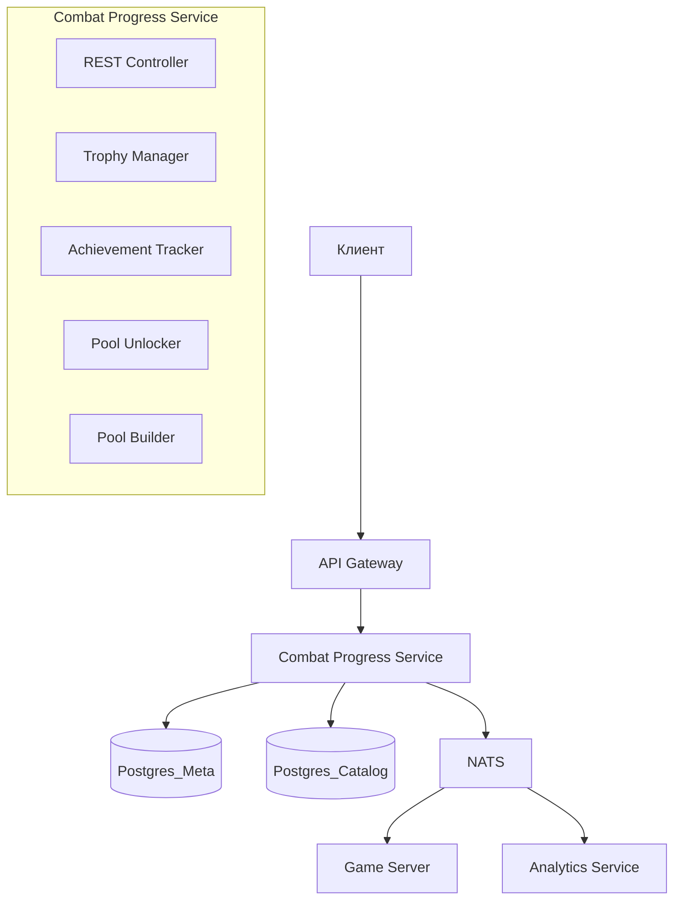

# 14. Combat Progress Service — Микросервис боевой прогрессии

## 1. Обзор

**Combat Progress Service** — микросервис, отвечающий за боевую прогрессию: Player Level (XP), достижения и разблокировку оружия/скиллов в боевой пул через **3-стримовый Battle Pass**.

### Battle Pass: 3 стрима
| Стрим | Контент | Условия разблокировки |
|-------|---------|----------------------|
| 🔴 Оружие | Melee, Pistols, SMG, Shotguns, Rifles | XP Level + Achievements |
| 🔵 Пассивки | Статы, защита, усиления | XP Level + Achievements |
| 🟠 Активки | Способности с кулдауном | XP Level + Achievements |

### Зона ответственности
- **Player Level (XP):** Начисление и хранение опыта
- **Достижения:** Отслеживание прогресса боевых целей
- **Battle Pass разблокировки:** Проверка условий (Level + Achievement)
- **Боевой пул:** Расчёт доступных предметов для матча
- **Трофеи (legacy):** Опциональный альтернативный путь разблокировки

### Не входит в ответственность
- Социальная прогрессия (здания) → **Building Service**
- Игровая логика матча → **Game Server**
- Выпадение лута в матче → **Game Server** (но использует данные пула)

---

## 2. Архитектура



---

## 3. REST API

### 3.1. Получить боевой профиль

```http
GET /api/v1/characters/{characterId}/combat
Authorization: Bearer <jwt>
```

**Response 200:**
```json
{
  "playerLevel": {
    "level": 8,
    "currentXP": 12500,
    "xpToNextLevel": 3000,
    "totalXP": 11250
  },
  "battlePass": {
    "weaponsUnlocked": 6,
    "weaponsTotal": 15,
    "passivesUnlocked": 5,
    "passivesTotal": 15,
    "activesUnlocked": 6,
    "activesTotal": 15
  },
  "trophies": [
    {
      "trophyId": "trophy_guard_badge",
      "name": "Жетон охранника",
      "category": "common",
      "quantity": 47
    },
    {
      "trophyId": "trophy_armor_fragment",
      "name": "Фрагмент брони",
      "category": "rare",
      "quantity": 12
    }
  ],
  "achievements": {
    "completed": 8,
    "total": 25,
    "recent": [
      {
        "achievementId": "ach_knife_kills_50",
        "name": "Мастер клинка",
        "completedAt": "2026-02-10T18:30:00Z"
      }
    ]
  },
  "combatPool": {
    "weapons": 12,
    "activeSkills": 8,
    "passiveSkills": 15
  }
}
```

### 3.2. Получить трофеи

```http
GET /api/v1/characters/{characterId}/combat/trophies
Authorization: Bearer <jwt>
```

**Response 200:**
```json
{
  "trophies": [
    {
      "trophyId": "trophy_guard_badge",
      "name": "Жетон охранника",
      "category": "common",
      "dropSource": "melee_guard",
      "quantity": 47,
      "usedFor": [
        {
          "itemType": "weapon",
          "itemId": "melee_conversation_starter",
          "name": "Кастет",
          "required": 10,
          "unlocked": true
        },
        {
          "itemType": "skill",
          "itemId": "perk_pistol_master",
          "name": "Мастер пистолетов",
          "required": 5,
          "unlocked": true
        }
      ]
    },
    {
      "trophyId": "trophy_specops_dog_tag",
      "name": "Жетон спецназа",
      "category": "epic",
      "dropSource": "specops",
      "quantity": 4,
      "usedFor": [
        {
          "itemType": "weapon",
          "itemId": "pistol_scalpel",
          "name": "Скальпель",
          "required": 2,
          "unlocked": true
        },
        {
          "itemType": "skill",
          "itemId": "perk_aggressor",
          "name": "Агрессор",
          "required": 4,
          "unlocked": true
        }
      ]
    }
  ]
}
```

### 3.3. Получить Player Level и XP

```http
GET /api/v1/characters/{characterId}/combat/level
Authorization: Bearer <jwt>
```

**Response 200:**
```json
{
  "level": 8,
  "currentXP": 12500,
  "xpToNextLevel": 3000,
  "totalXP": 11250,
  "xpHistory": [
    {
      "source": "heist_completed",
      "amount": 450,
      "matchId": "uuid-match",
      "timestamp": "2026-02-12T10:30:00Z"
    },
    {
      "source": "achievement_completed",
      "amount": 500,
      "achievementId": "ach_kills_100",
      "timestamp": "2026-02-12T09:15:00Z"
    }
  ]
}
```

### 3.4. Получить Battle Pass прогресс

```http
GET /api/v1/characters/{characterId}/combat/battlepass
Authorization: Bearer <jwt>
```

**Response 200:**
```json
{
  "playerLevel": 8,
  "streams": {
    "weapons": {
      "unlocked": ["pistol_persuader", "melee_stinger", "revolver", "shotgun_sawed", "smg_tommy"],
      "available": ["melee_silencer"],
      "locked": ["shotgun_grinder", "pistol_scalpel", "..."]
    },
    "passives": {
      "unlocked": ["perk_tough", "perk_fast", "perk_aim", "perk_pickpocket"],
      "available": ["perk_pistol_master"],
      "locked": ["perk_regen", "..."]
    },
    "actives": {
      "unlocked": ["skill_dash", "skill_medkit", "skill_smoke", "skill_grenade"],
      "available": ["skill_battlecry"],
      "locked": ["skill_molotov", "..."]
    }
  },
  "nextUnlocks": [
    {
      "stream": "weapons",
      "itemId": "melee_silencer",
      "name": "Молчун",
      "levelRequired": 6,
      "levelMet": true,
      "achievementRequired": "ach_melee_50",
      "achievementMet": false,
      "achievementProgress": 32,
      "achievementTarget": 50
    }
  ]
}
```

**Статусы предметов:**
- `unlocked` — условия выполнены, предмет в пуле
- `available` — уровень достигнут, но нужно достижение (или наоборот)
- `locked` — не хватает уровня

### 3.5. Получить достижения

```http
GET /api/v1/characters/{characterId}/combat/achievements
Authorization: Bearer <jwt>
```

**Response 200:**
```json
{
  "achievements": [
    {
      "achievementId": "ach_knife_kills_50",
      "name": "Мастер клинка",
      "description": "Убить 50 врагов оружием ближнего боя",
      "category": "combat",
      "progress": 50,
      "target": 50,
      "completed": true,
      "completedAt": "2026-02-10T18:30:00Z",
      "reward": {
        "itemType": "weapon",
        "itemId": "special_flamethrower",
        "name": "Огнемёт"
      }
    },
    {
      "achievementId": "ach_headshots_50",
      "name": "Снайпер",
      "description": "50 убийств в голову",
      "category": "combat",
      "progress": 32,
      "target": 50,
      "completed": false,
      "reward": {
        "itemType": "weapon",
        "itemId": "special_grenade_launcher",
        "name": "Гранатомёт"
      }
    },
    {
      "achievementId": "ach_stealth_heist_5",
      "name": "Призрак",
      "description": "5 ограблений без тревоги",
      "category": "stealth",
      "progress": 2,
      "target": 5,
      "completed": false,
      "reward": {
        "itemType": "skill",
        "itemId": "perk_shadow",
        "name": "Тень"
      }
    }
  ]
}
```

### 3.4. Получить боевой пул

```http
GET /api/v1/characters/{characterId}/combat/pool
Authorization: Bearer <jwt>
```

**Response 200:**
```json
{
  "weapons": [
    {
      "itemId": "pistol_persuader",
      "name": "Убеждатель",
      "type": "ranged",
      "category": "pistol",
      "rarity": "common",
      "unlockedAt": "2026-02-01T10:00:00Z"
    },
    {
      "itemId": "melee_stinger",
      "name": "Жало",
      "type": "melee",
      "category": "melee",
      "rarity": "common",
      "unlockedAt": "2026-02-01T10:00:00Z"
    },
    {
      "itemId": "smg_chicago_typewriter",
      "name": "Чикагская пишущая машинка",
      "type": "ranged",
      "category": "smg",
      "rarity": "rare",
      "unlockedAt": "2026-02-08T14:20:00Z"
    }
  ],
  "activeSkills": [
    {
      "itemId": "skill_dash",
      "name": "Рывок",
      "category": "mobility",
      "unlockedAt": "2026-02-01T10:00:00Z"
    },
    {
      "itemId": "skill_medkit",
      "name": "Аптечка",
      "category": "support",
      "unlockedAt": "2026-02-01T10:00:00Z"
    }
  ],
  "passiveSkills": [
    {
      "itemId": "perk_tough",
      "name": "Живучий",
      "category": "defense",
      "effect": "+20 HP",
      "unlockedAt": "2026-02-05T12:00:00Z"
    }
  ]
}
```

### 3.5. Разблокировать предмет (ручная трата трофеев)

```http
POST /api/v1/characters/{characterId}/combat/unlock
Authorization: Bearer <jwt>
Content-Type: application/json

{
  "itemType": "weapon",
  "itemId": "shotgun_street_sweeper"
}
```

**Response 200:**
```json
{
  "success": true,
  "unlocked": {
    "itemType": "weapon",
    "itemId": "shotgun_street_sweeper",
    "name": "Уборщик"
  },
  "trophiesSpent": [
    {
      "trophyId": "trophy_patrol_insignia",
      "quantity": 5
    }
  ],
  "userData": { ... }
}
```

**Ошибки:**
- `400 ALREADY_UNLOCKED` — уже разблокировано
- `400 INSUFFICIENT_TROPHIES` — недостаточно трофеев
- `400 ITEM_NOT_FOUND` — предмет не существует

### 3.6. Получить пул для матча (внутренний API)

```http
GET /api/v1/internal/characters/{characterId}/combat/match-pool
X-Internal-Key: <service_key>
```

**Response 200:**
```json
{
  "characterId": "uuid-123",
  "weaponPool": ["pistol_persuader", "melee_stinger", "smg_chicago_typewriter", ...],
  "activeSkillPool": ["skill_dash", "skill_medkit", "skill_smoke", ...],
  "passiveSkillPool": ["perk_tough", "perk_pistol_master", ...],
  "poolHash": "abc123"  // Для валидации на Game Server
}
```

---

## 4. NATS Events

### 4.1. Подписки (входящие)

```typescript
// Трофеи получены в матче (от Game Server)
interface TrophiesEarnedEvent {
  characterId: string;
  matchId: string;
  trophies: Array<{
    trophyId: string;
    quantity: number;
    source: string;  // enemy_id
  }>;
  timestamp: string;
}
// Topic: match.event.trophies_earned

// Статистика матча (для достижений + XP)
interface MatchStatsEvent {
  characterId: string;
  matchId: string;
  stats: {
    kills: number;
    meleeKills: number;
    headshots: number;
    damageDealt: number;
    damageTaken: number;
    revives: number;
    stealthKills: number;
    survivalTime: number;
  };
  matchResult: 'victory' | 'defeat' | 'abandoned';
  heistRank: 'C' | 'B' | 'A' | 'S';  // Для XP множителя
  wasNoAlarm: boolean;
  wasCoop: boolean;
  timestamp: string;
}
// Topic: match.event.completed
```

### 4.2. Публикуемые события

```typescript
// XP получен
interface XPEarnedEvent {
  characterId: string;
  source: 'heist_completed' | 'achievement' | 'daily_quest' | 'weekly_quest';
  amount: number;
  multiplier: number;  // 1.0 for C-rank, up to 3.0 for S-rank
  newTotalXP: number;
  newLevel: number;
  leveledUp: boolean;
  timestamp: string;
}
// Topic: combat.event.xp_earned

// Level Up
interface LevelUpEvent {
  characterId: string;
  oldLevel: number;
  newLevel: number;
  unlocksAvailable: Array<{
    stream: 'weapons' | 'passives' | 'actives';
    itemId: string;
    name: string;
    needsAchievement: boolean;
  }>;
  timestamp: string;
}
// Topic: combat.event.level_up

// Трофей добавлен (legacy)
interface TrophyAddedEvent {
  characterId: string;
  trophyId: string;
  quantityAdded: number;
  newTotal: number;
  timestamp: string;
}
// Topic: combat.event.trophy_added

// Достижение выполнено
interface AchievementCompletedEvent {
  characterId: string;
  achievementId: string;
  name: string;
  reward: {
    itemType: string;
    itemId: string;
  };
  timestamp: string;
}
// Topic: combat.event.achievement_completed

// Предмет разблокирован в пул
interface PoolItemUnlockedEvent {
  characterId: string;
  itemType: 'weapon' | 'active_skill' | 'passive_skill';
  itemId: string;
  unlockSource: 'trophy' | 'achievement';
  timestamp: string;
}
// Topic: combat.event.pool_item_unlocked

// Прогресс достижения обновлён
interface AchievementProgressEvent {
  characterId: string;
  achievementId: string;
  oldProgress: number;
  newProgress: number;
  target: number;
  timestamp: string;
}
// Topic: combat.event.achievement_progress
```

---

## 5. Внутренняя логика

### 5.1. Trophy Manager

```typescript
class TrophyManager {
  async addTrophies(characterId: string, trophies: TrophyDrop[]): Promise<void> {
    for (const trophy of trophies) {
      // Добавляем трофей
      await this.repo.addTrophy(characterId, trophy.trophyId, trophy.quantity);
      
      // Публикуем событие
      await this.nats.publish('combat.event.trophy_added', {
        characterId,
        trophyId: trophy.trophyId,
        quantityAdded: trophy.quantity,
        newTotal: await this.repo.getTrophyCount(characterId, trophy.trophyId)
      });
      
      // Проверяем авто-разблокировки
      await this.poolUnlocker.checkTrophyUnlocks(characterId, trophy.trophyId);
    }
  }
  
  async spendTrophies(characterId: string, trophyId: string, quantity: number): Promise<boolean> {
    const current = await this.repo.getTrophyCount(characterId, trophyId);
    if (current < quantity) return false;
    
    await this.repo.removeTrophy(characterId, trophyId, quantity);
    return true;
  }
}
```

### 5.2. Achievement Tracker

```typescript
class AchievementTracker {
  async processMatchStats(characterId: string, stats: MatchStats): Promise<void> {
    const achievements = await this.catalog.getAllAchievements();
    
    for (const achievement of achievements) {
      const progress = await this.repo.getProgress(characterId, achievement.id);
      if (progress.completed) continue;
      
      const newProgress = this.calculateProgress(achievement, stats, progress.current);
      
      if (newProgress > progress.current) {
        await this.repo.updateProgress(characterId, achievement.id, newProgress);
        
        // Публикуем прогресс
        await this.nats.publish('combat.event.achievement_progress', {
          characterId,
          achievementId: achievement.id,
          oldProgress: progress.current,
          newProgress,
          target: achievement.target
        });
        
        // Проверяем завершение
        if (newProgress >= achievement.target) {
          await this.completeAchievement(characterId, achievement);
        }
      }
    }
  }
  
  private calculateProgress(achievement: Achievement, stats: MatchStats, current: number): number {
    switch (achievement.conditionType) {
      case 'kills':
        if (achievement.condition.weaponType === 'melee') {
          return current + stats.meleeKills;
        }
        if (achievement.condition.headshot) {
          return current + stats.headshots;
        }
        return current + stats.kills;
        
      case 'heists':
        if (achievement.condition.noAlarm && stats.wasNoAlarm) {
          return current + 1;
        }
        if (achievement.condition.coop && stats.wasCoop) {
          return current + 1;
        }
        return current;
        
      case 'special':
        if (achievement.condition.revive) {
          return current + stats.revives;
        }
        // ... другие условия
    }
    return current;
  }
  
  private async completeAchievement(characterId: string, achievement: Achievement): Promise<void> {
    await this.repo.markCompleted(characterId, achievement.id);
    
    // Разблокируем награду
    await this.poolUnlocker.unlockFromAchievement(characterId, achievement.id);
    
    // Публикуем событие
    await this.nats.publish('combat.event.achievement_completed', {
      characterId,
      achievementId: achievement.id,
      name: achievement.name,
      reward: achievement.reward
    });
  }
}
```

### 5.3. Pool Unlocker

```typescript
class PoolUnlocker {
  async checkTrophyUnlocks(characterId: string, trophyId: string): Promise<void> {
    // Находим все предметы, которые можно разблокировать этим трофеем
    const requirements = await this.catalog.getRequirementsByTrophy(trophyId);
    
    for (const req of requirements) {
      // Проверяем, не разблокирован ли уже
      const alreadyUnlocked = await this.repo.isInPool(characterId, req.itemType, req.itemId);
      if (alreadyUnlocked) continue;
      
      // Проверяем, хватает ли трофеев
      const trophyCount = await this.trophyRepo.getTrophyCount(characterId, trophyId);
      if (trophyCount >= req.quantity) {
        // Автоматическая разблокировка
        await this.unlock(characterId, req.itemType, req.itemId, 'trophy');
      }
    }
  }
  
  async unlockFromAchievement(characterId: string, achievementId: string): Promise<void> {
    const req = await this.catalog.getRequirementByAchievement(achievementId);
    if (!req) return;
    
    await this.unlock(characterId, req.itemType, req.itemId, 'achievement');
  }
  
  private async unlock(
    characterId: string, 
    itemType: string, 
    itemId: string, 
    source: 'trophy' | 'achievement'
  ): Promise<void> {
    await this.repo.addToPool(characterId, itemType, itemId);
    
    await this.nats.publish('combat.event.pool_item_unlocked', {
      characterId,
      itemType,
      itemId,
      unlockSource: source
    });
  }
}
```

### 5.4. Pool Builder

```typescript
class PoolBuilder {
  async buildMatchPool(characterId: string): Promise<MatchPool> {
    const poolItems = await this.repo.getPool(characterId);
    
    const weapons = poolItems
      .filter(item => item.itemType === 'weapon')
      .map(item => item.itemId);
      
    const activeSkills = poolItems
      .filter(item => item.itemType === 'active_skill')
      .map(item => item.itemId);
      
    const passiveSkills = poolItems
      .filter(item => item.itemType === 'passive_skill')
      .map(item => item.itemId);
    
    // Добавляем стартовые предметы (всегда в пуле)
    const starterWeapons = ['pistol_persuader', 'melee_stinger'];
    const starterSkills = ['skill_dash', 'skill_medkit'];
    
    return {
      characterId,
      weaponPool: [...new Set([...starterWeapons, ...weapons])],
      activeSkillPool: [...new Set([...starterSkills, ...activeSkills])],
      passiveSkillPool: passiveSkills,
      poolHash: this.generateHash(poolItems)
    };
  }
}
```

---

## 6. База данных

### Используемые таблицы

```sql
-- Трофеи персонажа (Postgres_Meta)
SELECT * FROM character_trophies WHERE character_id = ?;

-- Прогресс достижений (Postgres_Meta)
SELECT * FROM character_achievements WHERE character_id = ?;

-- Боевой пул (Postgres_Meta)
SELECT * FROM character_combat_pool WHERE character_id = ?;

-- Справочники (Postgres_Catalog)
SELECT * FROM trophy_catalog;
SELECT * FROM achievement_catalog;
SELECT * FROM combat_unlock_requirements;
SELECT * FROM weapon_catalog;
SELECT * FROM skill_catalog;
```

---

## 7. Конфигурация

```yaml
# config/combat-progress-service.yaml
service:
  name: combat-progress-service
  port: 3005

database:
  meta:
    host: ${POSTGRES_META_HOST}
    database: survival_meta
  catalog:
    host: ${POSTGRES_CATALOG_HOST}
    database: survival_catalog

nats:
  url: ${NATS_URL}
  
features:
  autoUnlockOnTrophyThreshold: true  # Авто-разблокировка при достижении порога
  starterWeapons: ["pistol_persuader", "melee_stinger"]
  starterSkills: ["skill_dash", "skill_medkit"]
```

---

## 8. Метрики

```typescript
// Prometheus метрики
trophies_collected_total{trophy_id, category}       // Собрано трофеев
achievements_completed_total{achievement_id, category}  // Выполнено достижений
pool_items_unlocked_total{item_type, unlock_source}    // Разблокировано в пул
pool_size_gauge{character_id, item_type}               // Размер пула
```

---

## 9. Роуглайк-интеграция

### Как Game Server использует пул

1. **Перед матчем:** Game Server запрашивает `GET /internal/.../match-pool`
2. **В матче:** При выпадении лута Game Server выбирает случайный предмет из пула
3. **Веса:** Редкость предмета влияет на вероятность выпадения
4. **Валидация:** Game Server проверяет `poolHash` для защиты от читов

```typescript
// На Game Server
async function rollLoot(characterId: string): Promise<string> {
  const pool = await combatService.getMatchPool(characterId);
  
  // Взвешенный выбор по редкости
  const weights = pool.weaponPool.map(id => {
    const weapon = weaponCatalog.get(id);
    return { id, weight: getRarityWeight(weapon.rarity) };
  });
  
  return weightedRandom(weights);
}
```
