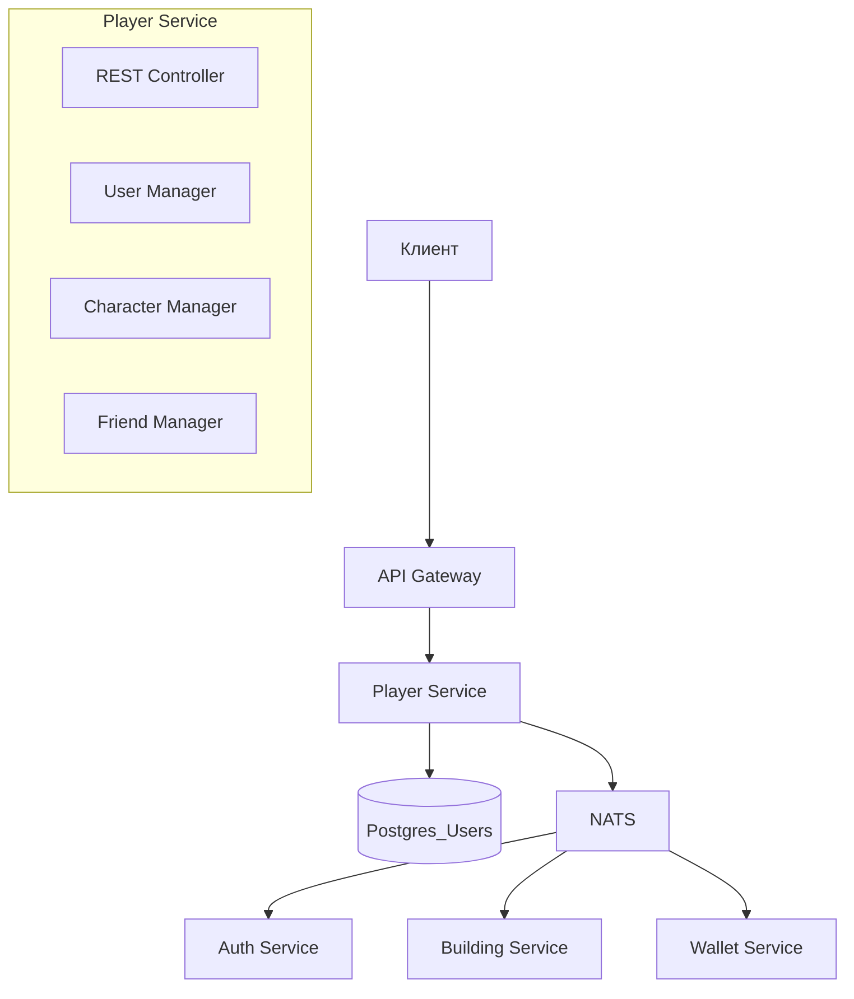

# 15. Player Service — Микросервис игроков и персонажей

## 1. Обзор

**Player Service** — микросервис, объединяющий управление аккаунтами пользователей и их персонажами.

### Зона ответственности
- CRUD аккаунтов (профиль пользователя)
- CRUD персонажей (у одного пользователя может быть несколько)
- Управление слотами персонажей
- Друзья и социальный граф
- Баны

### Не входит в ответственность
- Аутентификация (JWT) → **Auth Service**
- Валюта → **Wallet Service**
- Здания → **Building Service**
- Боевая прогрессия → **Combat Progress Service**

---

## 2. Архитектура



---

## 3. REST API

### 3.1. Пользователи (Users)

#### Получить профиль текущего пользователя

```http
GET /api/v1/users/me
Authorization: Bearer <jwt>
```

**Response 200:**
```json
{
  "id": "uuid-user-123",
  "email": "player@example.com",
  "charactersCount": 2,
  "charactersMax": 3,
  "createdAt": "2026-01-15T10:00:00Z",
  "lastLogin": "2026-02-11T08:30:00Z"
}
```

#### Обновить профиль

```http
PATCH /api/v1/users/me
Authorization: Bearer <jwt>
Content-Type: application/json

{
  "email": "newemail@example.com"
}
```

---

### 3.2. Персонажи (Characters)

#### Получить список персонажей

```http
GET /api/v1/users/me/characters
Authorization: Bearer <jwt>
```

**Response 200:**
```json
{
  "characters": [
    {
      "id": "uuid-char-1",
      "nickname": "ShadowBoss",
      "avatarUrl": "https://cdn.../avatar1.png",
      "level": 15,
      "createdAt": "2026-01-15T10:30:00Z"
    },
    {
      "id": "uuid-char-2",
      "nickname": "NightRaider",
      "avatarUrl": "https://cdn.../avatar2.png",
      "level": 8,
      "createdAt": "2026-02-01T14:00:00Z"
    }
  ],
  "slots": {
    "used": 2,
    "max": 3
  }
}
```

#### Создать персонажа

```http
POST /api/v1/users/me/characters
Authorization: Bearer <jwt>
Content-Type: application/json

{
  "nickname": "NewCharacter",
  "avatarUrl": "https://cdn.../avatar3.png"
}
```

**Response 201:**
```json
{
  "success": true,
  "character": {
    "id": "uuid-char-3",
    "nickname": "NewCharacter",
    "avatarUrl": "https://cdn.../avatar3.png",
    "level": 1,
    "createdAt": "2026-02-11T12:00:00Z"
  },
  "slots": {
    "used": 3,
    "max": 3
  }
}
```

**Ошибки:**
- `400 NO_SLOTS_AVAILABLE` — нет свободных слотов
- `400 NICKNAME_TAKEN` — никнейм занят
- `400 INVALID_NICKNAME` — недопустимые символы

#### Получить персонажа

```http
GET /api/v1/characters/{characterId}
Authorization: Bearer <jwt>
```

**Response 200:**
```json
{
  "id": "uuid-char-1",
  "userId": "uuid-user-123",
  "nickname": "ShadowBoss",
  "avatarUrl": "https://cdn.../avatar1.png",
  "level": 15,
  "createdAt": "2026-01-15T10:30:00Z"
}
```

#### Обновить персонажа

```http
PATCH /api/v1/characters/{characterId}
Authorization: Bearer <jwt>
Content-Type: application/json

{
  "nickname": "NewNickname",
  "avatarUrl": "https://cdn.../newavatar.png"
}
```

#### Удалить персонажа

```http
DELETE /api/v1/characters/{characterId}
Authorization: Bearer <jwt>
```

**Response 200:**
```json
{
  "success": true,
  "message": "Character deleted",
  "slots": {
    "used": 2,
    "max": 3
  }
}
```

---

### 3.3. Друзья (Friends)

#### Получить список друзей

```http
GET /api/v1/users/me/friends
Authorization: Bearer <jwt>
```

**Response 200:**
```json
{
  "friends": [
    {
      "userId": "uuid-friend-1",
      "nickname": "BestFriend",
      "status": "accepted",
      "since": "2026-01-20T15:00:00Z",
      "online": true
    }
  ],
  "pending": {
    "incoming": [
      {
        "userId": "uuid-pending-1",
        "nickname": "WantsToBeMyFriend",
        "requestedAt": "2026-02-10T10:00:00Z"
      }
    ],
    "outgoing": []
  }
}
```

#### Отправить запрос в друзья

```http
POST /api/v1/users/me/friends
Authorization: Bearer <jwt>
Content-Type: application/json

{
  "userId": "uuid-target-user"
}
```

#### Принять/отклонить запрос

```http
PATCH /api/v1/users/me/friends/{userId}
Authorization: Bearer <jwt>
Content-Type: application/json

{
  "action": "accept"  // или "reject"
}
```

#### Удалить из друзей

```http
DELETE /api/v1/users/me/friends/{userId}
Authorization: Bearer <jwt>
```

---

### 3.4. Полные данные игрока (UserData)

```http
GET /api/v1/users/me/full
Authorization: Bearer <jwt>
```

**Response 200:**
```json
{
  "user": {
    "id": "uuid-user-123",
    "email": "player@example.com",
    "charactersCount": 2,
    "charactersMax": 3
  },
  "characters": [ ... ],
  "activeCharacter": {
    "id": "uuid-char-1",
    "nickname": "ShadowBoss",
    "level": 15,
    "wallet": {
      "soft": 125000,
      "hard": 450
    },
    "buildings": [ ... ],
    "combatPool": {
      "weapons": 12,
      "activeSkills": 8,
      "passiveSkills": 15
    },
    "bonuses": {
      "hpBonus": 0.15,
      "accuracyBonus": 0.10
    }
  },
  "friends": [ ... ]
}
```

---

## 4. NATS Events

### 4.1. Публикуемые события

```typescript
// Пользователь создан
interface UserCreatedEvent {
  userId: string;
  email: string;
  timestamp: string;
}
// Topic: player.event.user_created

// Персонаж создан
interface CharacterCreatedEvent {
  userId: string;
  characterId: string;
  nickname: string;
  timestamp: string;
}
// Topic: player.event.character_created

// Персонаж удалён
interface CharacterDeletedEvent {
  userId: string;
  characterId: string;
  timestamp: string;
}
// Topic: player.event.character_deleted

// Слоты персонажей изменились
interface CharacterSlotsChangedEvent {
  userId: string;
  oldMax: number;
  newMax: number;
  source: string;  // "building_upgrade"
  timestamp: string;
}
// Topic: player.event.character_slots_changed
```

### 4.2. Подписки

```typescript
// Запрос на увеличение слотов (от Building Service)
// Topic: player.command.increase_character_slots
interface IncreaseCharacterSlotsCommand {
  userId: string;
  additionalSlots: number;
  source: string;
}

// Запрос данных пользователя
// Topic: player.query.get_user
// Response: player.reply.user_data

// Регистрация нового пользователя (от Auth Service)
// Topic: user.registered
interface UserRegisteredEvent {
  userId: string;
  username: string;
  email: string;
}
```

### 4.3. Флоу создания нового игрока (по событию)

`Player Service` является одним из ключевых подписчиков на событие `user.registered`. При получении этого события, он инициирует создание всех необходимых данных для нового игрока.

1.  **Создает запись `User`:** В своей базе данных создает основного пользователя.
2.  **Публикует `player.event.user_created`:** Сообщает другим системам, что базовый профиль игрока готов.
3.  **Вызывает `CharacterManager.createCharacter()`:** Создает персонажа по умолчанию.
4.  `CharacterManager`, в свою очередь, публикует событие `player.event.character_created`.
5.  На это новое событие реагируют другие сервисы:
    -   **`Meta Progression Service`:** Создает дефолтную мета-прогрессию.
    -   **`Building Service`:** Создает дефолтный набор зданий.

Таким образом, `Player Service` выступает координатором в процессе онбординга нового игрока.

---

## 5. Внутренняя логика

### 5.1. Character Manager

```typescript
class CharacterManager {
  async createCharacter(userId: string, data: CreateCharacterDto): Promise<Character> {
    // Проверяем слоты
    const user = await this.userRepo.getById(userId);
    if (user.charactersCount >= user.charactersMax) {
      throw new NoSlotsAvailableError();
    }
    
    // Проверяем никнейм
    const existing = await this.characterRepo.findByNickname(data.nickname);
    if (existing) {
      throw new NicknameTakenError();
    }
    
    // Создаём персонажа
    const character = await this.characterRepo.create({
      userId,
      nickname: data.nickname,
      avatarUrl: data.avatarUrl,
      level: 1
    });
    
    // Обновляем счётчик
    await this.userRepo.incrementCharacterCount(userId);
    
    // Инициализируем связанные данные
    await this.initializeCharacterData(character.id);
    
    // Публикуем событие
    await this.nats.publish('player.event.character_created', {
      userId,
      characterId: character.id,
      nickname: character.nickname
    });
    
    return character;
  }
  
  private async initializeCharacterData(characterId: string): Promise<void> {
    // Создаём кошелёк
    await this.walletService.createWallet(characterId);
    
    // Добавляем стартовые предметы в пул
    await this.combatService.initializeStarterPool(characterId);
  }
}
```

---

## 6. База данных

### Используемые таблицы (Postgres_Users)

```sql
-- Пользователи
CREATE TABLE users (
    id              BIGSERIAL PRIMARY KEY,
    email           VARCHAR(255) NOT NULL UNIQUE,
    password_hash   VARCHAR(255) NOT NULL,
    characters_count INT NOT NULL DEFAULT 0,
    characters_max  INT NOT NULL DEFAULT 3,
    created_at      TIMESTAMP NOT NULL DEFAULT NOW(),
    last_login      TIMESTAMP
);

-- Персонажи
CREATE TABLE characters (
    id              BIGSERIAL PRIMARY KEY,
    user_id         BIGINT NOT NULL REFERENCES users(id) ON DELETE CASCADE,
    nickname        VARCHAR(32) NOT NULL UNIQUE,
    avatar_url      VARCHAR(512),
    level           INT NOT NULL DEFAULT 1,
    created_at      TIMESTAMP NOT NULL DEFAULT NOW()
);

-- Друзья
CREATE TABLE friendships (
    id              BIGSERIAL PRIMARY KEY,
    user_id         BIGINT NOT NULL REFERENCES users(id) ON DELETE CASCADE,
    friend_id       BIGINT NOT NULL REFERENCES users(id) ON DELETE CASCADE,
    status          VARCHAR(16) NOT NULL DEFAULT 'pending',
    created_at      TIMESTAMP NOT NULL DEFAULT NOW(),
    UNIQUE(user_id, friend_id)
);

-- Баны
CREATE TABLE bans (
    id              BIGSERIAL PRIMARY KEY,
    user_id         BIGINT NOT NULL REFERENCES users(id) ON DELETE CASCADE,
    reason          TEXT NOT NULL,
    expires_at      TIMESTAMP,
    issued_by       BIGINT REFERENCES users(id),
    created_at      TIMESTAMP NOT NULL DEFAULT NOW()
);
```

---

## 7. Конфигурация

```yaml
# config/player-service.yaml
service:
  name: player-service
  port: 3002

database:
  users:
    host: ${POSTGRES_USERS_HOST}
    database: survival_users

nats:
  url: ${NATS_URL}
  
features:
  defaultCharacterSlots: 3
  maxCharacterSlots: 6
  nicknameMinLength: 3
  nicknameMaxLength: 32
  nicknameRegex: "^[a-zA-Z0-9_]+$"
```

---

## 8. Метрики

```typescript
// Prometheus метрики
users_created_total                    // Создано пользователей
characters_created_total               // Создано персонажей
characters_deleted_total               // Удалено персонажей
friendships_created_total{status}      // Запросы в друзья
active_users_gauge                     // Активные пользователи (онлайн)
```
