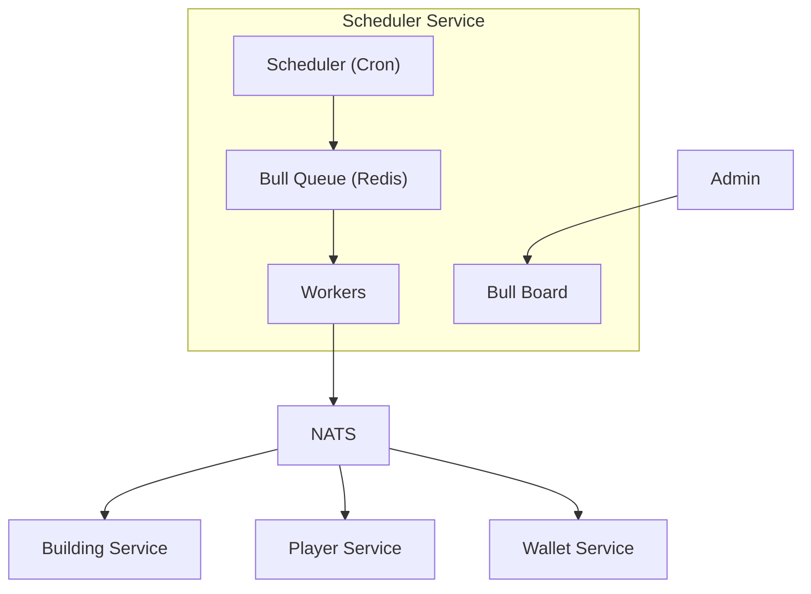

# 16. Scheduler Service — Планировщик задач (Bull)

## 1. Обзор

**Scheduler Service** — микросервис для выполнения отложенных и периодических задач на базе Bull (Redis).

### Зона ответственности
- Cron-задачи (ежечасные, ежедневные, еженедельные)
- Отложенные задачи (delayed jobs)
- Повторяющиеся задачи с retry
- Оповещение других сервисов через NATS

### Типы задач
- Начисление пассивного дохода
- Сброс ежедневных/еженедельных заданий
- Ротация магазина
- Очистка устаревших данных
- Рассылка пушей
- Обновление лидербордов

---

## 2. Архитектура



---

## 3. Bull Queues

### 3.1. Определение очередей

```typescript
// src/queues/index.ts
import Bull from 'bull';

const redisConfig = {
  host: process.env.REDIS_HOST,
  port: parseInt(process.env.REDIS_PORT || '6379'),
  password: process.env.REDIS_PASSWORD
};

// Основные очереди
export const passiveIncomeQueue = new Bull('passive-income', { redis: redisConfig });
export const dailyResetQueue = new Bull('daily-reset', { redis: redisConfig });
export const weeklyResetQueue = new Bull('weekly-reset', { redis: redisConfig });
export const leaderboardQueue = new Bull('leaderboard', { redis: redisConfig });
export const cleanupQueue = new Bull('cleanup', { redis: redisConfig });
export const notificationQueue = new Bull('notifications', { redis: redisConfig });
export const shopRotationQueue = new Bull('shop-rotation', { redis: redisConfig });
```

### 3.2. Настройка Cron Jobs

```typescript
// src/scheduler/cron-jobs.ts
import { passiveIncomeQueue, dailyResetQueue, weeklyResetQueue, ... } from '../queues';

export async function setupCronJobs(): Promise<void> {
  
  // Пассивный доход — каждый час
  await passiveIncomeQueue.add(
    'process-all',
    {},
    {
      repeat: { cron: '0 * * * *' },  // Каждый час в :00
      removeOnComplete: 100,
      removeOnFail: 50
    }
  );
  
  // Ежедневный сброс — 00:00 UTC
  await dailyResetQueue.add(
    'daily-reset',
    {},
    {
      repeat: { cron: '0 0 * * *' },
      removeOnComplete: 10
    }
  );
  
  // Еженедельный сброс — понедельник 00:00 UTC
  await weeklyResetQueue.add(
    'weekly-reset',
    {},
    {
      repeat: { cron: '0 0 * * 1' },
      removeOnComplete: 10
    }
  );
  
  // Обновление лидербордов — каждые 15 минут
  await leaderboardQueue.add(
    'update-rankings',
    {},
    {
      repeat: { cron: '*/15 * * * *' },
      removeOnComplete: 50
    }
  );
  
  // Ротация магазина — каждые 6 часов
  await shopRotationQueue.add(
    'rotate-shop',
    {},
    {
      repeat: { cron: '0 */6 * * *' },
      removeOnComplete: 10
    }
  );
  
  // Очистка старых данных — ежедневно в 03:00 UTC
  await cleanupQueue.add(
    'cleanup-old-data',
    {},
    {
      repeat: { cron: '0 3 * * *' },
      removeOnComplete: 10
    }
  );
}
```

---

## 4. Workers (Обработчики)

### 4.1. Passive Income Worker

```typescript
// src/workers/passive-income.worker.ts
import { passiveIncomeQueue } from '../queues';
import { natsClient } from '../nats';

passiveIncomeQueue.process('process-all', async (job) => {
  console.log(`[PassiveIncome] Starting job ${job.id}`);
  
  // Получаем всех персонажей с доходными зданиями
  const characters = await getCharactersWithIncomeBuildings();
  
  let processed = 0;
  let totalIncome = 0;
  
  for (const character of characters) {
    try {
      // Рассчитываем доход
      const income = calculatePassiveIncome(character.buildings);
      
      if (income > 0) {
        // Отправляем команду в Wallet Service
        await natsClient.publish('wallet.command.add_passive_income', {
          characterId: character.id,
          amount: income,
          source: 'passive_buildings',
          timestamp: new Date().toISOString()
        });
        
        totalIncome += income;
        processed++;
      }
    } catch (error) {
      console.error(`[PassiveIncome] Error for character ${character.id}:`, error);
      // Продолжаем с остальными
    }
  }
  
  console.log(`[PassiveIncome] Completed: ${processed} characters, ${totalIncome} total income`);
  
  return { processed, totalIncome };
});
```

### 4.2. Daily Reset Worker

```typescript
// src/workers/daily-reset.worker.ts
import { dailyResetQueue } from '../queues';
import { natsClient } from '../nats';

dailyResetQueue.process('daily-reset', async (job) => {
  console.log(`[DailyReset] Starting job ${job.id}`);
  
  // 1. Сброс ежедневных заданий
  await natsClient.publish('quests.command.reset_daily', {
    timestamp: new Date().toISOString()
  });
  
  // 2. Сброс ежедневных лимитов магазина
  await natsClient.publish('shop.command.reset_daily_limits', {
    timestamp: new Date().toISOString()
  });
  
  // 3. Обновление ежедневных предложений
  await natsClient.publish('shop.command.refresh_daily_offers', {
    timestamp: new Date().toISOString()
  });
  
  // 4. Сброс энергии до максимума (опционально)
  // await natsClient.publish('player.command.refill_energy', { ... });
  
  console.log(`[DailyReset] Completed`);
  
  return { success: true };
});
```

### 4.3. Weekly Reset Worker

```typescript
// src/workers/weekly-reset.worker.ts
import { weeklyResetQueue } from '../queues';
import { natsClient } from '../nats';

weeklyResetQueue.process('weekly-reset', async (job) => {
  console.log(`[WeeklyReset] Starting job ${job.id}`);
  
  // 1. Сброс еженедельных заданий
  await natsClient.publish('quests.command.reset_weekly', {
    timestamp: new Date().toISOString()
  });
  
  // 2. Начисление наград за лидерборды
  await natsClient.publish('leaderboard.command.distribute_rewards', {
    period: 'weekly',
    timestamp: new Date().toISOString()
  });
  
  // 3. Сброс еженедельных лидербордов
  await natsClient.publish('leaderboard.command.reset_weekly', {
    timestamp: new Date().toISOString()
  });
  
  console.log(`[WeeklyReset] Completed`);
  
  return { success: true };
});
```

### 4.4. Leaderboard Worker

```typescript
// src/workers/leaderboard.worker.ts
import { leaderboardQueue } from '../queues';
import { db } from '../database';

leaderboardQueue.process('update-rankings', async (job) => {
  console.log(`[Leaderboard] Starting rankings update`);
  
  const boardTypes = ['kills', 'wins', 'score', 'heists_completed'];
  
  for (const boardType of boardTypes) {
    // Обновляем ранги на основе score
    await db.query(`
      WITH ranked AS (
        SELECT 
          character_id,
          score,
          ROW_NUMBER() OVER (ORDER BY score DESC) as new_rank
        FROM leaderboards
        WHERE board_type = $1 AND season = $2
      )
      UPDATE leaderboards l
      SET rank = r.new_rank
      FROM ranked r
      WHERE l.character_id = r.character_id 
        AND l.board_type = $1 
        AND l.season = $2
    `, [boardType, getCurrentSeason()]);
  }
  
  console.log(`[Leaderboard] Rankings updated for ${boardTypes.length} boards`);
  
  return { boardsUpdated: boardTypes.length };
});
```

### 4.5. Cleanup Worker

```typescript
// src/workers/cleanup.worker.ts
import { cleanupQueue } from '../queues';
import { db } from '../database';

cleanupQueue.process('cleanup-old-data', async (job) => {
  console.log(`[Cleanup] Starting cleanup job`);
  
  const results = {
    expiredBans: 0,
    oldSessions: 0,
    oldMatchHistory: 0
  };
  
  // 1. Удаляем истекшие баны
  const bansResult = await db.query(`
    DELETE FROM bans 
    WHERE expires_at IS NOT NULL AND expires_at < NOW()
  `);
  results.expiredBans = bansResult.rowCount;
  
  // 2. Удаляем старые сессии (>30 дней)
  const sessionsResult = await db.query(`
    DELETE FROM sessions 
    WHERE last_activity < NOW() - INTERVAL '30 days'
  `);
  results.oldSessions = sessionsResult.rowCount;
  
  // 3. Архивируем старую историю матчей (>90 дней)
  const matchResult = await db.query(`
    DELETE FROM match_history 
    WHERE created_at < NOW() - INTERVAL '90 days'
  `);
  results.oldMatchHistory = matchResult.rowCount;
  
  console.log(`[Cleanup] Completed:`, results);
  
  return results;
});
```

### 4.6. Shop Rotation Worker

```typescript
// src/workers/shop-rotation.worker.ts
import { shopRotationQueue } from '../queues';
import { natsClient } from '../nats';

shopRotationQueue.process('rotate-shop', async (job) => {
  console.log(`[ShopRotation] Starting rotation`);
  
  // Генерируем новые предложения
  await natsClient.publish('shop.command.rotate_featured', {
    timestamp: new Date().toISOString()
  });
  
  console.log(`[ShopRotation] Completed`);
  
  return { success: true };
});
```

---

## 5. REST API (для ручного запуска и мониторинга)

### 5.1. Запустить задачу вручную

```http
POST /api/v1/scheduler/jobs/{jobType}/run
X-Admin-Key: <admin_key>
Content-Type: application/json

{
  "data": {}  // Опциональные данные
}
```

**Job Types:** `passive-income`, `daily-reset`, `weekly-reset`, `leaderboard`, `cleanup`, `shop-rotation`

**Response 200:**
```json
{
  "success": true,
  "jobId": "123",
  "queue": "passive-income",
  "status": "queued"
}
```

### 5.2. Получить статус очередей

```http
GET /api/v1/scheduler/queues
X-Admin-Key: <admin_key>
```

**Response 200:**
```json
{
  "queues": [
    {
      "name": "passive-income",
      "waiting": 0,
      "active": 1,
      "completed": 1523,
      "failed": 2,
      "delayed": 0,
      "paused": false
    },
    {
      "name": "daily-reset",
      "waiting": 0,
      "active": 0,
      "completed": 45,
      "failed": 0,
      "delayed": 1,
      "paused": false
    }
  ]
}
```

### 5.3. Получить историю задач

```http
GET /api/v1/scheduler/jobs/{jobType}/history?limit=10
X-Admin-Key: <admin_key>
```

**Response 200:**
```json
{
  "jobs": [
    {
      "id": "123",
      "status": "completed",
      "data": {},
      "result": { "processed": 1500, "totalIncome": 45000 },
      "createdAt": "2026-02-11T12:00:00Z",
      "completedAt": "2026-02-11T12:00:05Z",
      "duration": 5000
    }
  ]
}
```

### 5.4. Приостановить/возобновить очередь

```http
POST /api/v1/scheduler/queues/{queueName}/pause
X-Admin-Key: <admin_key>
```

```http
POST /api/v1/scheduler/queues/{queueName}/resume
X-Admin-Key: <admin_key>
```

---

## 6. Bull Board (Dashboard)

```typescript
// src/dashboard.ts
import { createBullBoard } from '@bull-board/api';
import { BullAdapter } from '@bull-board/api/bullAdapter';
import { ExpressAdapter } from '@bull-board/express';
import * as queues from './queues';

const serverAdapter = new ExpressAdapter();
serverAdapter.setBasePath('/admin/queues');

createBullBoard({
  queues: [
    new BullAdapter(queues.passiveIncomeQueue),
    new BullAdapter(queues.dailyResetQueue),
    new BullAdapter(queues.weeklyResetQueue),
    new BullAdapter(queues.leaderboardQueue),
    new BullAdapter(queues.cleanupQueue),
    new BullAdapter(queues.shopRotationQueue),
    new BullAdapter(queues.notificationQueue)
  ],
  serverAdapter
});

// Mount: app.use('/admin/queues', serverAdapter.getRouter());
```

**URL:** `https://api.game.com/admin/queues`

---

## 7. Отложенные задачи (Delayed Jobs)

### Пример: Напоминание об энергии

```typescript
// Когда энергия восстановится полностью
async function scheduleEnergyFullNotification(
  characterId: string, 
  minutesToFull: number
): Promise<void> {
  await notificationQueue.add(
    'energy-full',
    {
      characterId,
      type: 'energy_full'
    },
    {
      delay: minutesToFull * 60 * 1000,  // Задержка в мс
      attempts: 3,
      backoff: {
        type: 'exponential',
        delay: 5000
      }
    }
  );
}
```

### Пример: Истечение таймера строительства

```typescript
async function scheduleBuildingComplete(
  characterId: string,
  buildingId: string,
  buildTimeMinutes: number
): Promise<void> {
  await notificationQueue.add(
    'building-complete',
    {
      characterId,
      buildingId
    },
    {
      delay: buildTimeMinutes * 60 * 1000,
      jobId: `building-${characterId}-${buildingId}`,  // Уникальный ID для отмены
      attempts: 3
    }
  );
}

// Отмена (если ускорили за кристаллы)
async function cancelBuildingTimer(characterId: string, buildingId: string): Promise<void> {
  const job = await notificationQueue.getJob(`building-${characterId}-${buildingId}`);
  if (job) {
    await job.remove();
  }
}
```

---

## 8. Конфигурация

```yaml
# config/scheduler-service.yaml
service:
  name: scheduler-service
  port: 3010

redis:
  host: ${REDIS_HOST}
  port: 6379
  password: ${REDIS_PASSWORD}
  
nats:
  url: ${NATS_URL}

queues:
  defaultAttempts: 3
  defaultBackoff:
    type: exponential
    delay: 5000
    
dashboard:
  enabled: true
  path: /admin/queues
  auth:
    username: admin
    password: ${BULL_BOARD_PASSWORD}

cron:
  passiveIncome: "0 * * * *"      # Каждый час
  dailyReset: "0 0 * * *"         # 00:00 UTC
  weeklyReset: "0 0 * * 1"        # Понедельник 00:00 UTC
  leaderboard: "*/15 * * * *"     # Каждые 15 минут
  shopRotation: "0 */6 * * *"     # Каждые 6 часов
  cleanup: "0 3 * * *"            # 03:00 UTC
```

---

## 9. Метрики

```typescript
// Prometheus метрики
scheduler_jobs_processed_total{queue, status}    // Обработано задач
scheduler_jobs_duration_seconds{queue}           // Время выполнения
scheduler_queue_size{queue, state}               // Размер очереди
scheduler_job_retries_total{queue}               // Повторные попытки
```
