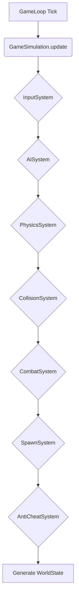

# Внутренняя архитектура Gameplay Service

Этот документ описывает полное внутреннее устройство `Gameplay Service`: управление множеством игровых симуляций (Manager/Factory), TypeScript-интерфейсы, детали реализации `GameSimulation` и ECS-подобные системы внутри одного инстанса.

---

## 1. Внутренний Оркестратор (Паттерн: Manager/Factory)

`Gameplay Service` выступает в роли **менеджера** или **фабрики** для инстансов `GameSimulation`. Его основная задача — управлять жизненным циклом симуляций.

### Класс: `GameplayService`

```typescript
class GameplayService {
  private simulations: Map<string, IGameSimulation>;

  constructor() {
    this.simulations = new Map<string, IGameSimulation>();
    this.subscribeToNats();
  }

  private subscribeToNats(): void {
    // Подписывается на 'gameplay.start_simulation'
    // При получении сообщения, вызывает createSimulation()
  }

  private createSimulation(matchId: string, players: Player[]): void {
    const newSimulation = new GameSimulation(matchId, players);
    this.simulations.set(matchId, newSimulation);
    newSimulation.start();
  }
  
  // Другие методы для остановки и удаления симуляций...
}
```

-   **`simulations`**: Основная структура данных, `Map`, где ключ — `matchId`, а значение — запущенный инстанс `IGameSimulation`.
-   **Логика:** При получении команды `gameplay.start_simulation` из NATS, он создает новый объект `GameSimulation`, добавляет его в `Map` и запускает его.

---

## 2. Интерфейсы симуляции

### `IGameSimulation` — интерфейс инстанса игры

Описывает методы, которые должен предоставлять каждый инстанс симуляции.

```typescript
import { PlayerInput } from './player_input';

interface IGameSimulation {
  /** Уникальный идентификатор этого инстанса игры/матча. */
  readonly instanceId: string;

  /** Текущее состояние игры. */
  readonly state: IGameState;

  /** Запускает игровой цикл (GameLoop) для этого инстанса. */
  start(): void;

  /** Останавливает игровой цикл. */
  stop(): void;

  /**
   * Добавляет ввод от игрока в очередь на обработку в следующем тике.
   * @param playerId - ID игрока.
   * @param input - Объект с данными ввода.
   */
  addPlayerInput(playerId: string, input: PlayerInput): void;

  /**
   * Обновляет состояние симуляции на один шаг (тик).
   * @param deltaTime - Время, прошедшее с предыдущего тика, в секундах.
   */
  update(deltaTime: number): void;
}
```

### `IGameState` — интерфейс состояния игры

Описывает структуру данных, хранящуюся в `Gameplay Service` для каждого активного инстанса — «снимок» текущего состояния матча.

```typescript
interface IPlayerState {
  playerId: string;
  position: { x: number; y: number };
  health: number;
}

interface IGameState {
  /** Уникальный идентификатор, совпадает с IGameSimulation.instanceId. */
  readonly instanceId: string;

  /** Map с состояниями всех игроков: ключ — playerId, значение — состояние. */
  readonly players: Map<string, IPlayerState>;

  /** Время с начала матча в миллисекундах. */
  readonly gameTimeMs: number;

  /** Текущий статус матча. */
  readonly status: 'waiting' | 'in_progress' | 'finished';
}
```

---

## 3. Инстанс Симуляции (Паттерн: ECS-like Systems)

Каждый инстанс симуляции инкапсулирует в себе всю логику одного матча. Архитектура внутри симуляции построена по принципу, схожему с **ECS (Entity-Component-System)**, где разные подсистемы отвечают за свою часть логики.

### Класс: `GameSimulation`

```typescript
class GameSimulation implements IGameSimulation {
  public readonly instanceId: string;
  public state: IGameState;
  
  // Буферы для Lag Compensation и предсказаний
  private inputBuffer: RingBuffer<PlayerInputWithTimestamp>;
  private stateBuffer: RingBuffer<WorldStateWithTimestamp>;
  
  // Подсистемы
  // ...
  
  private gameLoop: GameLoop;

  constructor(matchId: string, players: Player[]) {
    // ...инициализация
    this.inputBuffer = new RingBuffer(128); // Храним последние ~2 секунды ввода
    this.stateBuffer = new RingBuffer(64); // Храним последние ~1 секунду состояний
  }

  public addPlayerInput(playerId: string, input: PlayerInput): void {
    // Добавляем ввод в буфер с серверной временной меткой
    this.inputBuffer.add({ ...input, receivedAt: Date.now() });
  }
  
  public update(deltaTime: number): void {
    // 1. Обработать ввод из буфера
    this.processInputs();
    
    // ... (обновление подсистем) ...

    // 6. Сгенерировать WorldState
    const newWorldState = this.generateWorldState();

    // 7. Сохранить состояние в буфер
    this.stateBuffer.add({ ...newWorldState, timestamp: Date.now() });

    // 8. Отправить WorldState клиентам
    this.publishWorldState(newWorldState);
  }

  /**
   * "Отматывает" мир назад для точной проверки, например, выстрела.
   * @param timestamp - Временная метка события на клиенте.
   */
  private rewindAndCheck(timestamp: number): IGameState {
    // 1. Найти два ближайших состояния в stateBuffer, между которыми находится timestamp.
    // 2. Интерполировать между ними, чтобы получить точное состояние мира на этот момент.
    // 3. Вернуть "отмотанное" состояние для дальнейших проверок (например, hit detection).
    return {} as IGameState;
  }
  
  // ...другие методы
}
```

**Ключевые компоненты:**
-   **`inputBuffer`**: Кольцевой буфер для `PlayerInput`. Каждый `input` сохраняется с серверной временной меткой `receivedAt` для анализа задержек.
-   **`stateBuffer`**: Кольцевой буфер, хранящий последние N состояний мира (`WorldState`) вместе с их серверными временными метками. Это позволяет "отматывать" время.
-   **`GameLoop`**: Объект, реализующий логику таймера с самокоррекцией (см. `21_game_loop_best_practices.md`). Он вызывает `update()` этого класса.
-   **Подсистемы (`Systems`):** Каждый отвечает за свой аспект игры:
    -   `PhysicsSystem`: Движение, коллизии.
    -   `CombatSystem`: Логика выстрелов, урона. При проверке попадания вызывает `rewindAndCheck()` для компенсации лага.
    -   `AISystem`: Поведение врагов.
    -   `SpawnSystem`: Логика появления новых врагов (волны).
-   **`rewindAndCheck(timestamp)`**: Ключевой метод для **Lag Compensation**. Когда сервер обрабатывает выстрел, он смотрит на `clientTimestamp` этого выстрела, находит соответствующее прошлое состояние мира в `stateBuffer` и производит проверку попадания в "прошлом".

---

## 4. Описание ECS-систем

`GameSimulation` вызывает системы в строгом порядке на каждом тике. Каждая система отвечает только за свою часть логики.

### а) `InputSystem` (Обработка ввода)
-   **Задача:** Преобразовать сырой ввод игроков (`PlayerInput`) в изменения компонентов сущностей.
-   **Логика:**
    1.  Читает `inputBuffer`.
    2.  Для каждого игрока обновляет `VelocityComponent` (на основе `movement`) и `AimComponent` (на основе `aimAngle`).
    3.  Если в `actions` есть «shoot» или «use_skill», создаёт `WantsToShootComponent`.

### б) `AISystem` (Искусственный интеллект)
-   **Задача:** Принятие решений для всех NPC (врагов).
-   **Логика:** Для каждого врага анализирует окружение, выбирает цель, обновляет `VelocityComponent` и `WantsToShootComponent`.

### в) `PhysicsSystem` (Физика и движение)
-   **Задача:** Обновление позиций всех движущихся объектов.
-   **Логика:** Итерирует по сущностям с `PositionComponent` + `VelocityComponent`, применяет `velocity * deltaTime`, базовую физику.

### г) `CollisionSystem` (Проверка столкновений)
-   **Задача:** Обнаружение пересечений между объектами.
-   **Логика:** Проверяет AABB-пересечения через **Spatial Grid** / **Quadtree**, при обнаружении коллизии генерирует `CollisionEventComponent({ entityA, entityB })`.

### д) `CombatSystem` (Боевая система)
-   **Задача:** Обработка урона, стрельбы, применения скиллов.
-   **Логика:**
    1.  Ищет сущности с `WantsToShootComponent`.
    2.  Выполняет **Raycast** из позиции в направлении `AimComponent`.
    3.  **Вызывает `rewindAndCheck()`** для компенсации лага стреляющего.
    4.  При попадании создаёт `DamageEventComponent`, уменьшает `HealthComponent` у цели.

### е) `SpawnSystem` (Спавн врагов)
-   **Задача:** Создание новых сущностей по правилам игрового режима.
-   **Логика:** Следит за таймером волны / триггерами, создаёт сущности врагов с начальными компонентами.

### ж) `AntiCheatSystem` (Мониторинг читеров)
-   **Задача:** Обнаружение аномального поведения.
-   **Логика:** Сравнивает позицию текущего тика с предыдущим; если `distance / deltaTime` превышает максимальную скорость игрока — увеличивает счётчик нарушений, при достижении порога отправляет алерт.

---

## 5. Диаграммы взаимодействия

### Порядок выполнения в `update()`


### Поток данных
```mermaid
graph TD
    subgraph "NATS (Внутри Зоны)"
        subgraph "Входящие"
            A[player.input.{matchId}.*]
        end
        subgraph "Исходящие"
            B[gameplay.world_state.{matchId}]
        end
    end

    subgraph "GameplayService"
        C(Оркестратор инстансов)
        D(Map<matchId, GameSimulation>)
    end
    
    subgraph "GameSimulation (Один матч)"
        E(Update Loop)
        F(Системы: AI, Physics, Combat...)
        G(Состояние мира)
    end

    A --> C;
    C -- Находит нужный инстанс --> D;
    D -- Передает Input --> G;
    E -- Вызывает --> F;
    F -- Модифицируют --> G;
    E -- Генерирует из G --> B;
```

---

## 6. Соответствие GDD и клиентской реализации

Предложенная серверная архитектура полностью соответствует тому, что было спроектировано в GDD и частично имитируется на клиенте.

| Серверная реализация | GDD | Клиентская реализация | Соответствие |
|---|---|---|---|
| `GameLoop` с фиксированным тиком | Прямое соответствие. Описан `GameLoop` с `Fixed Tick Rate`. | `ServerGameLoop` | ✅ Да |
| `inputBuffer` для `PlayerInput` | Прямое соответствие. Описан `InputBuffer`. | `InputBuffer` | ✅ Да |
| Отправка `WorldState` после тика | Прямое соответствие. Описана отправка `StateBuffer`. | `ServerGameBridge` ожидает `WorldState`. | ✅ Да |
| `PhysicsSystem` / `CombatSystem` | Логическое соответствие. `04_anti_cheat_and_validation.md` и другие описывают эту логику. | Есть `PhysicsSystem`, `CombatSystem` в клиентской симуляции. | ✅ Да |
| Интерфейсы `PlayerInput`, `WorldState` | Прямое соответствие. `25_api_and_websocket_contracts.md` описывает эти структуры. | Используются те же DTO. | ✅ Да |
