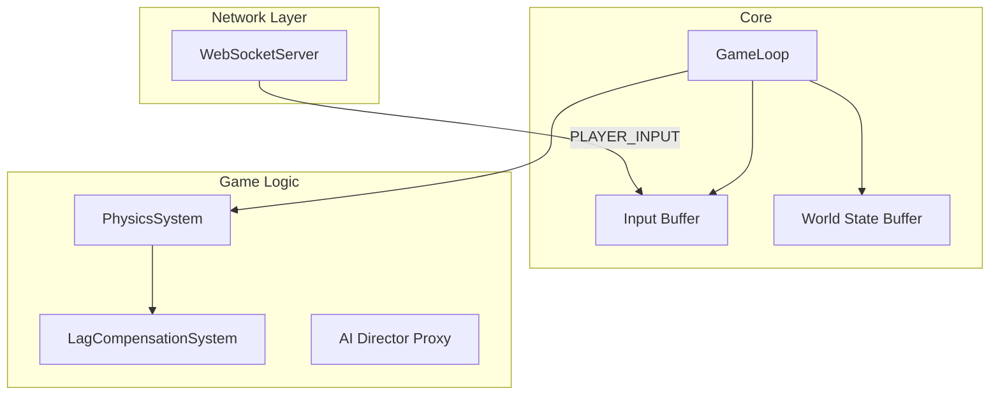

# 28. Архитектура игрового сервера (Node.js/Bun) (v3 - Восстановленная)

## 1. Философия: Детерминированный игровой цикл и буферы состояний

Сервер является **абсолютным источником правды**. Его главная задача — запускать детерминированную симуляцию мира с фиксированным шагом времени (например, 30 раз в секунду) и хранить историю этой симуляции, чтобы разрешать действия игроков, приходящие с задержкой.

## 2. Основные компоненты



-   **`WebSocketServer`:** Принимает сообщения от клиентов, валидирует их и складывает в `InputBuffer`.
-   **`GameLoop`:** Сердце сервера. Работает с фиксированной частотой (например, 30 FPS). На каждом "тике":
    1.  Берет инпуты из `InputBuffer`.
    2.  Запускает `PhysicsSystem` для шага симуляции.
    3.  Сохраняет новое состояние мира в `StateBuffer`.
    4.  Рассылает `WORLD_STATE` клиентам (с меньшей частотой, ~10 FPS).
-   **`InputBuffer`:** Хранит последние N инпутов от каждого клиента.
-   **`StateBuffer`:** Хранит последние N состояний мира.
-   **`PhysicsSystem`:** Детерминированная физическая симуляция (использует `collision_utils.ts`).
-   **`LagCompensationSystem`:** Использует `InputBuffer` и `StateBuffer` для "отмотки времени".

## 3. Детальная структура буферов

### `InputBuffer`
-   **Структура:** `Map<playerId, RingBuffer<PlayerInput>>`
    -   `RingBuffer` (Кольцевой буфер) — эффективная структура для хранения последних N элементов.
-   **`PlayerInput` (объект для хранения):**
    ```typescript
    interface PlayerInput {
      sequence_id: number;
      client_time: number;
      ping: number;
      joystick_vector: {x: number, y: number};
      actions: Action[];
      states: { is_firing: boolean };
    }
    ```
-   **Логика:** Когда приходит новый инпут, он добавляется в буфер. Если буфер полон, самый старый инпут затирается.

### `StateBuffer`
-   **Структура:** `RingBuffer<WorldState>`
-   **`WorldState` (объект для хранения):**
    ```typescript
    interface WorldState {
      server_time: number;
      entities: Map<entityId, EntityState>;
    }

    interface EntityState {
      position: {x: number, y: number};
      // ...другие важные для отмотки данные
    }
    ```
-   **Логика:** После каждого тика `GameLoop` сохраняет полное состояние всех сущностей в этот буфер.

## 4. Продвинутая Компенсация Лага (с использованием буферов)

1.  **Вход:** Действие (например, `SHOOT`), `client_time` и `ping` от стреляющего.
2.  **Вычисление времени:**
    -   Задержка в одну сторону: `one_way_latency = ping / 2`.
    -   **Целевое время в прошлом:** `rewind_time = client_time - one_way_latency`.
3.  **"Отмотка мира":**
    -   Система находит в `StateBuffer` два ближайших к `rewind_time` состояния мира.
    -   Для **каждой сущности** в мире она вычисляет ее точную позицию в момент `rewind_time` путем **линейной интерполяции**.
4.  **Проверка попадания:** В этом идеально реконструированном "призрачном" мире прошлого выполняется проверка столкновения.

## 5. Обработка ввода (Input Processing)

### 5.1. Интерпретация `joystick_vector`
-   Сервер на каждом тике получает `joystick_vector`.
-   **Прицеливание:** Если `vector.magnitude > AIM_THRESHOLD`, сервер обновляет направление взгляда (`rotation`) персонажа.
-   **Движение:** Если `vector.magnitude > MOVE_THRESHOLD`, сервер применяет к персонажу `velocity` в этом направлении.

### 5.2. Обработка автоматического оружия
-   Сервер не использует эвенты "начала" и "конца" огня.
-   **Логика:**
    1.  На каждом тике сервер получает от клиента флаг `is_firing`.
    2.  Если `is_firing` равен `true`, сервер проверяет **свои авторитативные данные**:
        -   Есть ли у игрока патроны?
        -   Не находится ли оружие на кулдауне (согласно его скорострельности)?
    3.  Если все проверки пройдены, сервер выполняет логику выстрела (Raycast с компенсацией лага), уменьшает количество патронов и устанавливает для оружия внутренний таймер до следующего возможного выстрела.

## 6. План разработки сервера

### Фаза 1: Ядро симуляции
1.  Реализовать `GameLoop` с фиксированным шагом времени.
2.  Реализовать `InputBuffer` и `StateBuffer` на основе кольцевых буферов.
3.  Создать базовый `PhysicsSystem` (движение, без коллизий).
4.  Интегрировать `WebSocketServer`, который просто складывает инпуты в буфер.
5.  Настроить рассылку `WORLD_STATE` клиентам.

### Фаза 2: Физика и компенсация лага
1.  Интегрировать `collision_utils.ts` в `PhysicsSystem`.
2.  Реализовать `LagCompensationSystem` с логикой "отмотки" через `StateBuffer`.
3.  Внедрить вызов `LagCompensationSystem` при обработке выстрелов.

### Фаза 3: Игровая логика
1.  Реализовать `AiDirectorProxy`, который будет общаться с LLM.
2.  Написать логику для обработки команд от директора (спавн врагов, ивенты).
3.  Реализовать всю остальную игровую логику (здоровье, инвентарь и т.д.).
