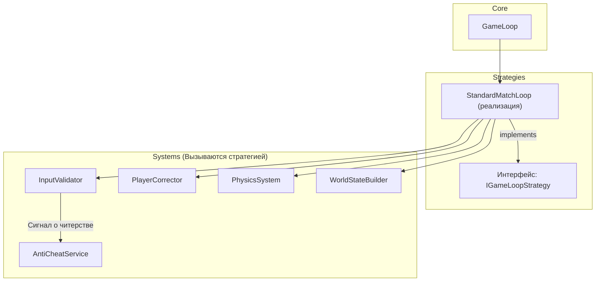

# 34. Архитектура Anti-Cheat и валидации

## 1. Фундаментальная философия: Never Trust the Client (Никогда не доверяй клиенту)

Сервер является абсолютным и единственным источником правды. Любые данные, приходящие от клиента (`PLAYER_INPUT`), — это не команда, а **предложение**, которое сервер должен тщательно проверить (валидировать), прежде чем принять.

## 2. Архитектура игрового цикла (Game Loop)

Как вы и предложили, игровой цикл будет построен на паттерне **Strategy**, что позволит нам в будущем легко подменять логику (например, для разных режимов игры).

### 2.1. Диаграмма классов

### 2.2. План-алгоритм работы `StandardMatchLoop.update(dt)`

Это сердце нашего сервера, работающее с фиксированной частотой (например, 30 раз в секунду).

1.  **Собрать инпуты:** Получить все `PLAYER_INPUT` пакеты, пришедшие с прошлого тика, из `InputBuffer`.
2.  **Валидировать инпуты (`InputValidator`):** Для каждого инпута провести серию проверок:
    -   **Speed Hack:** `новое_расстояние = new_pos - last_pos`. `макс_возможное = скорость_игрока * dt`. Если `новое_расстояние > макс_возможное * 1.2` (небольшой допуск на лаг), **инпут считается невалидным**.
    -   **Cooldowns:** `время_с_последнего_выстрела < скорострельность_оружия`? **Действие "SHOOT" невалидно.**
    -   **Дальность атаки:** Игрок пытается ударить ножом врага в 10 метрах от себя? **Действие "MELEE_ATTACK" невалидно.**
    -   **Сигнал о читерстве:** Если `InputValidator` фиксирует систематические невалидные инпуты от одного игрока (например, 3 speed hack флага за 1 секунду), он отправляет сигнал в `AntiCheatService`.
3.  **Скорректировать состояние (`PlayerCorrector`):**
    -   Если инпут игрока был признан невалидным (например, он пытался сдвинуться слишком далеко), его `position` в серверной симуляции **не меняется**.
    -   В следующем `WORLD_STATE`, который будет отправлен клиенту, будет содержаться **правильная, серверная позиция**. На клиенте это вызовет эффект "резинки" (rubber banding) — персонажа отбросит назад в валидную точку. Это естественное и ожидаемое поведение для игрока с лагами или для читера.
4.  **Применить валидные инпуты:** Все действия, прошедшие проверку, применяются к сущностям.
5.  **Запустить физику (`PhysicsSystem`):** Выполнить шаг физической симуляции (движение, коллизии) на основе уже примененных инпутов.
6.  **Создать `WORLD_STATE` (`WorldStateBuilder`):**
    -   Сформировать новое, авторитативное состояние мира.
    -   Используя `Delta Compression` и `Interest Management`, создать персонализированные пакеты для каждого игрока.
    -   Сохранить полное состояние в `StateBuffer` для реплеев.

---

### 3. Реплей-система как Anti-Cheat

Данные, которые мы сохраняем в ClickHouse (инпуты и состояния мира), являются идеальным инструментом для пост-анализа. Можно создать оффлайн-инструмент, который будет:
-   Визуализировать любой прошедший матч.
-   Автоматически анализировать инпуты игроков на подозрительные паттерны (например, слишком точное прицеливание — aimbot).
-   Предоставлять доказательную базу для блокировки игроков.
