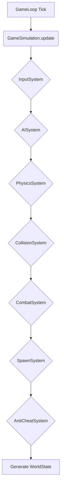

# Внутренняя архитектура инстанса симуляции

Этот документ детально описывает классы, интерфейсы и паттерны, используемые внутри одного инстанса `GameSimulation` в `Gameplay Service`.

## Паттерн: ECS-like Systems (Системный подход)

В основе архитектуры лежит подход, схожий с **ECS (Entity-Component-System)**. Вместо огромного класса, который делает всё, мы разделяем всю логику на независимые, узкоспециализированные **"Системы"**.

-   **`GameSimulation`** выступает в роли главного **оркестратора**. Он владеет состоянием мира и на каждом тике вызывает по очереди каждую систему.
-   Каждая **система** отвечает только за свою часть логики (например, `PhysicsSystem` двигает объекты, `CombatSystem` обрабатывает урон).

---

## 1. Главный класс: `GameSimulation`

Это "оркестратор" для одного матча.

```typescript
class GameSimulation implements IGameSimulation {
  public readonly instanceId: string;
  public state: IGameState;
  
  private systems: ISystem[];
  private gameLoop: GameLoop;

  constructor(matchId: string, players: Player[]) {
    // ...инициализация state...
    
    this.systems = [
      new InputSystem(),
      new AISystem(),
      new PhysicsSystem(),
      new CollisionSystem(),
      new CombatSystem(),
      new SpawnSystem(),
      new AntiCheatSystem(),
    ];
    
    this.gameLoop = new GameLoop(() => this.update(this.gameLoop.deltaTime));
  }
  
  public update(deltaTime: number): void {
    // Системы вызываются в строгом порядке
    for (const system of this.systems) {
      system.update(this.state, deltaTime);
    }
    
    // После всех обновлений, генерируем и отправляем состояние
    this.publishWorldState();
  }
  
  // ...start(), stop(), addPlayerInput()...
}
```

---

## 2. Описание Систем

### а) `InputSystem` (Обработка ввода)
-   **Задача:** Преобразовать сырой ввод игроков (`PlayerInput`) в конкретные изменения состояния (компонентов) сущностей.
-   **Логика:**
    1.  Читает `inputBuffer`.
    2.  Для каждого игрока обновляет его компоненты: `VelocityComponent` (на основе `movement`), `AimComponent` (на основе `aimAngle`).
    3.  Если в `actions` есть "shoot" или "use_skill", создает "одноразовые" компоненты-события, например `WantsToShootComponent`.

### б) `AISystem` (Искусственный интеллект)
-   **Задача:** Принятие решений для всех NPC (врагов).
-   **Логика:**
    1.  Для каждого врага анализирует окружение (позиции игроков, препятствия).
    2.  Выбирает цель и стратегию (атаковать, преследовать, отступать).
    3.  Обновляет компоненты врага, например `VelocityComponent` (куда двигаться) и `WantsToShootComponent` (если решил атаковать).

### в) `PhysicsSystem` (Физика и движение)
-   **Задача:** Обновление позиций всех движущихся объектов.
-   **Логика:**
    1.  Итерирует по всем сущностям, у которых есть `PositionComponent` и `VelocityComponent`.
    2.  Обновляет `position`, применяя `velocity * deltaTime`.
    3.  Применяет базовую физику (трение, гравитация, если нужно).

### г) `CollisionSystem` (Проверка столкновений)
-   **Задача:** Обнаружение пересечений (коллизий) между объектами.
-   **Логика:**
    1.  Используя оптимизированную структуру данных (например, **Spatial Grid** или **Quadtree**), проверяет пересечения AABB (Axis-Aligned Bounding Box) всех сущностей.
    2.  При обнаружении коллизии, **не решает, что делать**, а генерирует событие или добавляет компоненты-события, например `CollisionEventComponent({ entityA, entityB })`.
    3.  Разрешение коллизий (отталкивание) может быть здесь же или в `PhysicsSystem`.

### д) `CombatSystem` (Боевая система)
-   **Задача:** Обработка урона, стрельбы, применения скиллов.
-   **Логика:**
    1.  Ищет сущности с компонентом `WantsToShootComponent`.
    2.  Для каждой такой сущности выполняет **Raycast** из ее позиции в направлении `AimComponent`.
    3.  **Использует `rewindAndCheck()`** для получения "отмотанного" состояния мира, чтобы компенсировать лаг стреляющего.
    4.  Если Raycast пересекся с врагом, создает событие `DamageEventComponent({ target, damage })`.
    5.  Обрабатывает `DamageEventComponent`, уменьшая `HealthComponent` у цели.

### е) `SpawnSystem` (Спавн врагов)
-   **Задача:** Создание новых сущностей (врагов) по правилам игрового режима.
-   **Логика:**
    1.  Следит за таймером волны или другими триггерами (например, убийство всех врагов).
    2.  Когда триггер срабатывает, создает новые сущности врагов, добавляя их в `state` с начальными компонентами (`Position`, `Health` и т.д.).

### ж) `AntiCheatSystem` (Мониторинг читеров)
-   **Задача:** Обнаружение аномального поведения игроков.
-   **Логика (для телепортов):**
    1.  Хранит позицию каждого игрока из **предыдущего** тика.
    2.  В текущем тике сравнивает новую позицию со старой.
    3.  Вычисляет пройденное расстояние: `distance = new_pos.distanceTo(old_pos)`.
    4.  Если `distance / deltaTime` **превышает** максимально возможную скорость игрока (с небольшим запасом), увеличивает счетчик нарушений для этого игрока.
    5.  При достижении порога — отправляет событие-алерт.

---

## 3. Диаграммы взаимодействия

### Порядок выполнения в `update()`


### Поток данных
```mermaid
graph TD
    subgraph "NATS (Внутри Зоны)"
        subgraph "Входящие"
            A[player.input.{matchId}.*]
        end
        subgraph "Исходящие"
            B[gameplay.world_state.{matchId}]
        end
    end

    subgraph "GameplayService"
        C(Оркестратор инстансов)
        D(Map<matchId, GameSimulation>)
    end
    
    subgraph "GameSimulation (Один матч)"
        E(Update Loop)
        F(Системы: AI, Physics, Combat...)
        G(Состояние мира)
    end

    A --> C;
    C -- Находит нужный инстанс --> D;
    D -- Передает Input --> G;
    E -- Вызывает --> F;
    F -- Модифицируют --> G;
    E -- Генерирует из G --> B;
```
