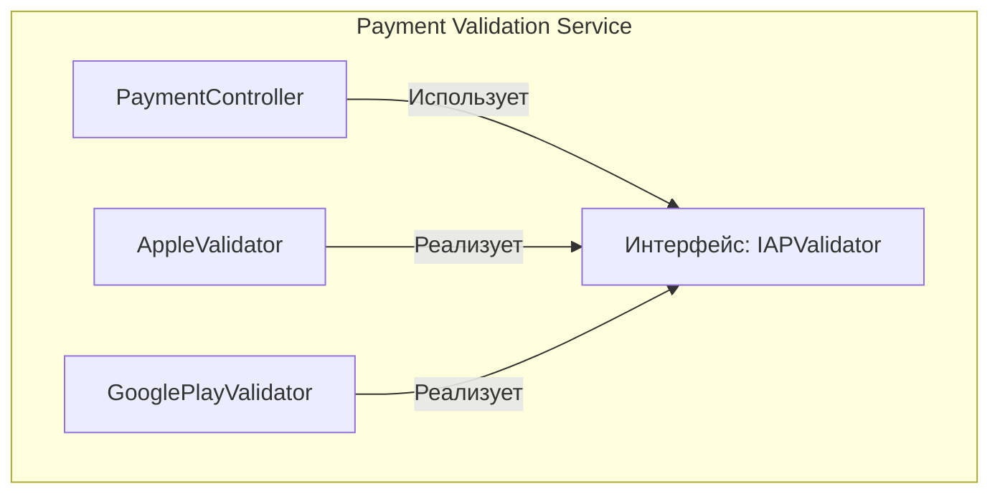

# 36. Архитектура сервиса валидации покупок (IAP)

## 1. Назначение и философия

**Никогда не доверяй клиенту в вопросах денег.** Когда клиент сообщает "я совершил покупку", мы **обязаны** проверить чек этой покупки напрямую у Apple App Store или Google Play Store, прежде чем начислять ему премиум-валюту.

Этот процесс будет вынесен в отдельный, изолированный микросервис.

## 2. Архитектура: Абстракция через паттерн "Strategy"

### 2.1. Диаграмма классов

### 2.2. Классы и их роли

#### `IAPValidator` (Интерфейс/Абстракция)
-   **Роль:** Определяет "контракт" для всех валидаторов.
-   **Метод:** `Future<ValidationResult> validate(String receiptData);`
-   `ValidationResult`: Объект, содержащий информацию о том, валидна ли покупка, и `product_id` купленного товара.

#### `AppleValidator` / `GooglePlayValidator` (Стратегии)
-   **Роль:** Конкретные реализации для каждой платформы.
-   **Логика:**
    -   Получают `receiptData` (данные чека) от клиента.
    -   Формируют HTTP-запрос к серверам Apple/Google.
    -   Отправляют `receiptData` на валидацию.
    -   Анализируют ответ и возвращают стандартизированный `ValidationResult`.

#### `PaymentController` (Контроллер)
-   **Роль:** Принимает HTTP-запросы от клиента.
-   **Логика:**
    1.  Получает запрос, содержащий `platform` ('apple'/'google') и `receiptData`.
    2.  В зависимости от `platform`, выбирает нужную реализацию `IAPValidator` (AppleValidator или GooglePlayValidator).
    3.  Вызывает метод `validate()`.
    4.  Если результат `SUCCESS`:
        -   Обращается к `Postgres_Meta` и начисляет игроку премиум-валюту.
        -   Отправляет аналитический эвент `iap_purchase_success`.
        -   Возвращает клиенту обновленный `UserData`.

## 3. Схема взаимодействия

1.  **Клиент (в игре):** Игрок совершает покупку через нативный SDK от Apple/Google.
2.  **Клиент:** SDK возвращает `receiptData` (длинную зашифрованную строку).
3.  **Клиент:** Отправляет `POST /payments/validate` на наш сервер, передав `{ "platform": "apple", "receiptData": "..." }`.
4.  **Payment Service:** Выбирает `AppleValidator` и отправляет `receiptData` на серверы Apple.
5.  **Apple:** Отвечает: "Да, чек валиден, куплен товар 'gems_pack_1'".
6.  **Payment Service:** Начисляет игроку кристаллы и возвращает клиенту `200 OK` с обновленными данными.

Этот подход делает систему безопасной (мы всегда проверяем чек у первоисточника) и расширяемой (добавить нового поставщика, например, Steam, — значит просто добавить новый класс `SteamValidator`).
