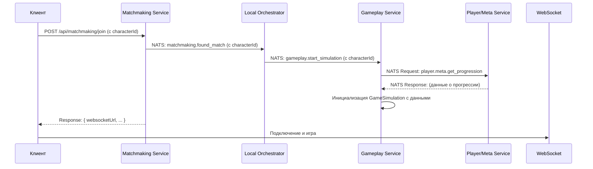

# Поток инициализации игры

Этот документ описывает расширенный процесс начала матча, включая выбор персонажа и загрузку мета-прогрессии для генерации лута.

## Общая схема

Процесс вовлекает несколько сервисов, которые обмениваются информацией через NATS.



## 1. Запрос на поиск игры (изменение)

Контракт `POST /api/matchmaking/join` теперь включает `characterId`.

```json
{
  "gameMode": "string",
  "characterId": "string" 
}
```

Этот `characterId` теперь "путешествует" вместе с данными о матче по всей цепочке: от `Matchmaking` к `Local Orchestrator` и, наконец, к `Gameplay Service`.

## 2. Запуск симуляции в `Gameplay Service`

Получив команду `gameplay.start_simulation` (которая теперь тоже содержит `characterId` для каждого игрока), `Gameplay Service` **перед** созданием инстанса `GameSimulation` выполняет критически важный шаг.

### Запрос данных о мета-прогрессии

`Gameplay Service` **не хранит** данные об игроках. Он должен запросить их у специализированного сервиса (назовем его `Player/Meta Service`).

#### NATS Request-Reply

-   **Тема запроса:** `player.meta.get_progression`
-   **Request Payload:**
    ```json
    {
      "playerIds": ["playerId1", "playerId2", ...],
      "characterIds": ["charId1", "charId2", ...]
    }
    ```
-   **Response Payload:**
    ```json
    {
      "players": [
        {
          "playerId": "playerId1",
          "characterId": "charId1",
          "progression": {
            "unlocked_weapons": ["weapon_id_1", "weapon_id_3"],
            "unlocked_skills": ["skill_id_2"],
            "character_level": 15
          }
        },
        // ... другие игроки
      ]
    }
    ```

## 3. Инициализация `GameSimulation`

Только **после** получения ответа от `Player/Meta Service`, `Gameplay Service` создает инстанс `GameSimulation`.

```typescript
// В GameplayService
private async createSimulation(matchData) {
  
  // 1. Запрашиваем данные о прогрессии
  const progressionData = await this.nats.request('player.meta.get_progression', {
    playerIds: matchData.players.map(p => p.id),
    characterIds: matchData.players.map(p => p.charId)
  });

  // 2. Создаем симуляцию, передав ей данные
  const simulation = new GameSimulation(
    matchData.matchId,
    progressionData.players
  );

  this.simulations.set(matchData.matchId, simulation);
  simulation.start();
}
```

## 4. Использование данных в `SpawnSystem`

Теперь, когда `GameSimulation` создана с данными о мета-прогрессии, `SpawnSystem` (и другие системы) может использовать их.

-   Когда `SpawnSystem` решает сгенерировать лут, он смотрит в `state.players[playerId].progression`.
-   Он берет список `unlocked_weapons` и `unlocked_skills`.
-   Лутом может стать **только** предмет из этих списков.

Это гарантирует, что игроки получают в матче только тот лут, который они разблокировали в мета-игре.
